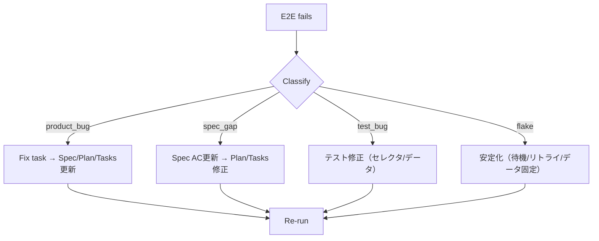

# Evaluation Response: SDD Templates v1.2.2-tecnos

本ドキュメントは、`templates_v1.2.2-tecnos_evaluation.md` の評価内容を検証し、追加のブラッシュアップ案を提示するものです。

---

## 1. 評価の妥当性検証

### 1.1 正確性（Accuracy）

| 評価項目 | 判定 | コメント |
|----------|------|----------|
| Coverage Policy 3層モデル | ✅ 正確 | Layer-1/2/3の定義と効果を正しく捉えている |
| Tagged AC | ✅ 正確 | Traceability強化の効果を正しく評価 |
| 二重ループ設計 | ✅ 正確 | Inner/Outer Loopの役割分担を正しく理解 |
| 整合性テーブル | ✅ 正確 | 全テンプレート間の参照関係を正しく検証 |

**結論**: 評価の主要ポイントは正確であり、v1.2.2の価値を適切に捉えています。

### 1.2 見落とし・補足すべき点

評価ドキュメントで触れられていない重要な点：

| 見落とし | 重要度 | 説明 |
|----------|--------|------|
| Triage分類の詳細 | 高 | 4分類（product_bug/spec_gap/test_bug/flake）とSpec/Plan/Tasks還流の仕組み |
| `covers_contract_ids` | 高 | CT→TS-CONトレーサビリティの機械評価 |
| `tests_must_be_tasked` | 高 | Plan上のTSがTasksにタスク化されることの強制（計画倒れ防止） |
| 段階的導入設計 | 中 | `coverage_policy` 未定義時は warning、`enforce=true` で fail |
| `covers_bpmn_element_ids` | 中 | BPMN要素へのテストトレーサビリティ |
| speckit-lint の `--coverage-report` | 低 | カバレッジレポート出力機能 |

### 1.3 Pros/Cons の妥当性

すべて妥当です。特に「High Friction（初期コスト）」は**最大の課題**であり、対策が必要です。

---

## 2. 評価で不足している観点

### 2.1 speckit-lint 実装の検証
- 「lint仕様はあるが、実装は？」という問いへの回答がない
- speckit-lint 自体のテスト戦略（Unit/Integration/E2E）が必要

### 2.2 既存プロジェクトからの移行パス
- v1.2.0-tecnos からの移行手順が未定義
- 破壊的変更（`e2e_tagged_ac` の追加等）への段階的対応が必要

### 2.3 開発者向けドキュメント
- テンプレートは「自己説明的」か？
- 新規参画者のオンボーディングコスト
- クイックスタートガイドの必要性

### 2.4 パフォーマンス考慮
- speckit-lint の処理速度（多数のfeatureがある場合）
- CI実行時間への影響

---

## 3. ブラッシュアップ案（v1.2.2 以降向け）

### 3.1 High Friction 問題への対策（優先度: 最高）

評価で指摘された「初期コストの高さ」への対策：

#### A) Scaffold Generator の導入
```bash
# 提案: basic_design からの自動生成コマンド
speckit scaffold --from basic_design.md --generate spec,plan,tasks
```

**期待効果**:
- YAML記述量を 60-70% 削減
- basic_design の品質が下流に直結するため、HITL段階での品質担保が効く

#### B) Minimal Template の提供
```yaml
# 提案: "必須フィールドのみ" の軽量テンプレート
templates_v1.2.2-tecnos-minimal/
├── templates/
│   ├── spec_template_minimal.md    # ACタグ・NFR最小
│   ├── plan_template_minimal.md    # coverage_policy なし
│   └── tasks_template_minimal.md   # E2Eタスクなし
```

**用途**: 小規模機能、PoC、プロトタイプ向け

### 3.2 speckit-lint 実装ガイドの追加（優先度: 高）

#### 提案: `tools/speckit_lint_implementation_guide.md`
```yaml
# 内容案
1. 検証ロジックの疑似コード（Python/TypeScript）
2. 各Failure Codeのテストケース例
3. CI統合例（GitHub Actions / GitLab CI）
4. パフォーマンス考慮事項
5. 拡張ポイント（カスタムルール追加方法）
```

### 3.3 移行ガイドの追加（優先度: 高）

#### 提案: `MIGRATION.md`
```markdown
# Migration Guide: v1.2.0-tecnos → v1.2.2-tecnos

## Breaking Changes
- spec_template: `e2e_tagged_ac` count 追加
- plan_template: `coverage_policy` セクション追加
- tasks_template: E2Eタスク（T-G04-*）追加

## Migration Steps
1. spec.md: derived_fields.counts に `e2e_tagged_ac: 0` 追加
2. plan.md: `coverage_policy` を空または false で初期化（段階的導入）
3. tasks.md: E2Eタスクは任意（e2eタグ付きACがなければ不要）

## Backward Compatibility
- coverage_policy がない場合、speckit-lint は warning のみ（fail しない）
- 既存プロジェクトは段階的に移行可能
```

### 3.4 追加のテスト戦略強化（優先度: 中）

評価では触れられていませんが、以下の拡張が有効です：

#### A) Mutation Testing（変異テスト）
```yaml
# plan_template.md への追加案
test_strategy:
  coverage_policy:
    mutation_testing:
      enabled: false
      tool: "stryker"
      target_score: 70
      scope: ["LIB-*"]
```

**効果**: コードカバレッジだけでなく、テストの「殺傷力」を測定

#### B) Security Scanning Integration
```yaml
# plan_template.md への追加案
test_strategy:
  security_scanning:
    sast:
      enabled: true
      tool: "semgrep"
    dast:
      enabled: false
      tool: "zap"
      scope: "e2e-flows"
```

**効果**: Tecnos の監査・セキュリティ要件との整合

#### C) Accessibility Testing（a11y）
```yaml
# plan_template.md への追加案
test_strategy:
  accessibility:
    enabled: false
    tool: "axe-core"
    scope: ["TS-E2E-*"]
    wcag_level: "AA"
```

**効果**: UI機能のアクセシビリティ担保

### 3.5 ドキュメント改善（優先度: 中）

#### A) クイックスタートガイド
```markdown
# 提案: QUICKSTART.md
1. 最小限のワークフロー（5ステップ）
2. 各テンプレートの「最初の10行」解説
3. speckit-lint の最初の実行例
4. よくある間違いと対処法
```

#### B) チートシート
```markdown
# 提案: CHEATSHEET.md
- ID規約一覧（正規表現）
- Gate条件一覧
- Failure Code一覧と対処法
- タグ一覧と対応テスト種別
```

### 3.6 運用監視の強化（優先度: 低）

#### Coverage Trend Tracking
```yaml
# 提案: speckit-lint --coverage-report の拡張
coverage_history:
  enabled: true
  storage: "specs/<feature>/metrics/coverage_history.json"
  retention_days: 90
  trend_alert:
    ac_coverage_drop_threshold: 5  # 5%低下でアラート
    ct_coverage_drop_threshold: 5
```

**効果**: カバレッジの経時変化を追跡し、品質低下を早期検知

---

## 4. 優先度マトリクス

| 改善案 | 効果 | 工数 | 優先度 |
|--------|------|------|--------|
| Scaffold Generator | 高 | 高 | ⭐⭐⭐ |
| Minimal Template | 中 | 低 | ⭐⭐⭐ |
| speckit-lint 実装ガイド | 高 | 中 | ⭐⭐⭐ |
| 移行ガイド（MIGRATION.md）| 高 | 低 | ⭐⭐⭐ |
| クイックスタートガイド | 中 | 低 | ⭐⭐ |
| チートシート | 中 | 低 | ⭐⭐ |
| Mutation Testing | 中 | 中 | ⭐ |
| Security Scanning | 中 | 中 | ⭐ |
| Accessibility Testing | 低 | 低 | ⭐ |
| Coverage Trend Tracking | 低 | 中 | ⭐ |

---

## 5. 結論

### 5.1 評価ドキュメントへの総合評価
**評価は概ね正確かつ有用**です。特に以下の点は的確です：
- 3層Coverage Modelの価値
- 二重ループ設計の合理性
- Enterprise Gradeの実現

### 5.2 最大の課題
評価で指摘された **「High Friction（初期コスト）」** は確かに最大の課題であり、以下の対策を **v1.2.2 で優先的に実施** すべきです：

1. **Scaffold Generator** - basic_design からの自動生成
2. **Minimal Template** - 軽量版テンプレート
3. **MIGRATION.md** - 移行ガイド
4. **QUICKSTART.md** - クイックスタートガイド

### 5.3 推奨アクション
1. **即座適用推奨** という評価結論に同意します
2. ただし、High Friction 対策を並行して進めることを強く推奨します
3. 既存プロジェクトへの適用は、移行ガイド作成後に実施すべきです

---

## Appendix: 評価で見落とされた機能の詳細

### A. Triage 4分類と還流フロー


### B. `covers_contract_ids` の効果
```yaml
# 従来（v1.2.0）
tests:
  - id: "TS-CON-01"
    covers_acceptance_ids: ["AC-US-XXX-001-01"]  # ACへのトレースのみ

# 新規（v1.2.2）
tests:
  - id: "TS-CON-01"
    covers_acceptance_ids: ["AC-US-XXX-001-01"]
    covers_contract_ids: ["CT-API-01"]           # CTへのトレース追加
```

**効果**: 「契約テストがどの契約をカバーしているか」を機械評価可能に

### C. `tests_must_be_tasked` の効果
```yaml
# Plan
tests:
  - id: "TS-INT-01"
  - id: "TS-E2E-01"

# Tasks（TS-E2E-01 が plan_refs に含まれていない場合）
tasks:
  - id: "T-G03-001"
    plan_refs: ["TS-INT-01"]  # TS-E2E-01 がない！

# speckit-lint
# → FAIL: TEST_NOT_TASKED (TS-E2E-01)
```

**効果**: 「Planに書いたがTasksに落とさなかった」を防止

---

> End of evaluation_response.md
