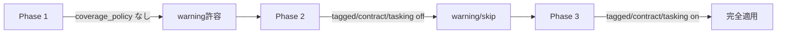

# Migration Guide: v1.2.0-tecnos → v1.2.1-tecnos

本ガイドでは、`templates_v1.2.0-tecnos` から `templates_v1.2.1-tecnos` への移行手順を説明します。

---

## 1. 変更サマリー

| カテゴリ | 変更内容 | 影響度 | 対応必須 |
|----------|----------|--------|----------|
| **Spec** | `e2e_tagged_ac` カウント追加 | 低 | Yes |
| **Plan** | `coverage_policy` セクション追加 | 高 | Yes（段階的可） |
| **Plan** | `tooling` / `reporting` セクション追加 | 中 | No（E2E使用時のみ） |
| **Plan** | `covers_contract_ids` フィールド追加 | 中 | Yes（段階的可） |
| **Tasks** | E2Eタスク（T-G04-*）追加 | 中 | No（E2E使用時のみ） |
| **Lint** | 新Failure Code追加 | 高 | Yes |

---

## 2. Breaking Changes

### 2.1 spec_template.md

**変更点**: `derived_fields.counts` に `e2e_tagged_ac` が追加

```yaml
# v1.2.0-tecnos
derived_fields:
  counts:
    use_cases: 0
    acceptance_criteria: 0
    integration_tagged_ac: 0  # 既存
    # e2e_tagged_ac は存在しない

# v1.2.1-tecnos
derived_fields:
  counts:
    use_cases: 0
    acceptance_criteria: 0
    integration_tagged_ac: 0
    e2e_tagged_ac: 0           # ← 追加
```

**移行手順**:
1. `spec.md` の `derived_fields.counts` に `e2e_tagged_ac: 0` を追加
2. E2Eタグ付きACがあれば、その数をカウント

### 2.2 plan_template.md

**変更点1**: `test_strategy.coverage_policy` セクション追加

```yaml
# v1.2.1-tecnos で追加
test_strategy:
  coverage_policy:
    acceptance_coverage_required: true
    acceptance_coverage_target_pct: 100
    tagged_acceptance_requirements:
      integration:
        enforce: true
        required_test_type: "integration"
      e2e:
        enforce: true
        required_test_type: "e2e"
    contract_coverage_required: true
    contract_coverage_target_pct: 100
    tests_must_be_tasked: true
    ci_gate_is_deterministic: true
    allow_exploratory_agent_in_ci_gate: false
```

**移行手順（段階的）**:
1. **Phase 1（警告のみ）**: `coverage_policy` を追加せず、tagged/contract/test-tasking の検証は warning/skip（AC Coverage は常に検証）
2. **Phase 2（soft enforcement）**: `coverage_policy` を追加し、`tagged_acceptance_requirements.<tag>.enforce: false` / `contract_coverage_required: false` / `tests_must_be_tasked: false` で開始
3. **Phase 3（full enforcement）**: `tagged_acceptance_requirements.<tag>.enforce: true` / `contract_coverage_required: true` / `tests_must_be_tasked: true` に変更

**変更点2**: `tests[].covers_contract_ids` フィールド追加

```yaml
# v1.2.0-tecnos
tests:
  - id: "TS-CON-01"
    covers_acceptance_ids: ["AC-US-XXX-001-01"]
    # covers_contract_ids は存在しない

# v1.2.1-tecnos
tests:
  - id: "TS-CON-01"
    covers_acceptance_ids: ["AC-US-XXX-001-01"]
    covers_contract_ids: ["CT-API-01"]  # ← 追加
```

**移行手順**:
1. 各 `TS-CON-*` テストに `covers_contract_ids` を追加
2. Contract Test が実際にカバーする CT-ID をリストアップ

### 2.3 tasks_template.md

**変更点**: E2Eタスクグループ（G-04-e2e-tests）追加

```yaml
# v1.2.1-tecnos で追加
task_groups:
  - id: "G-04-e2e-tests"
    label: "E2E Tests (Smoke Regression)"
    plan_refs: ["TS-E2E-*"]

tasks:
  - id: "T-G04-001"
    title: "Setup Playwright E2E environment"
    # ...
```

**移行手順**:
- E2Eテストを使用しない場合: 追加不要
- E2Eテストを使用する場合: G-04グループとT-G04-*タスクを追加

---

## 3. speckit-lint 新Failure Code

以下のFailure Codeが v1.2.1 で追加されました：

| Code | 説明 | 対応方法 |
|------|------|----------|
| `AC_NOT_COVERED` | ACがどのTSにもカバーされていない | TSに`covers_acceptance_ids`を追加 |
| `TAGGED_AC_NOT_COVERED_BY_REQUIRED_TEST_TYPE` | タグ付きACが適切なテストタイプでカバーされていない | integration→TS-INT-*, e2e→TS-E2E-* |
| `CONTRACT_COVERAGE_INCOMPLETE` | CTがTS-CONでカバーされていない | TS-CON-*の`covers_contract_ids`を追加 |
| `TEST_NOT_TASKED` | Planのテストがタスク化されていない | Tasks.mdに該当タスクを追加 |
| `E2E_REPORTING_NOT_CONFIGURED` | E2E使用時にreporting未設定 | plan.md に reporting セクション追加 |
| `E2E_TRIAGE_NOT_DEFINED` | E2E使用時にtriage手順未定義 | e2e-triage.md を作成 |

---

## 4. 移行チェックリスト

### 4.1 必須対応

- [ ] `spec.md`: `derived_fields.counts.e2e_tagged_ac` を追加
- [ ] `plan.md`: `coverage_policy` セクションを追加（段階的可）
- [ ] `plan.md`: Contract Test に `covers_contract_ids` を追加

### 4.2 E2E使用時のみ

- [ ] `plan.md`: `tooling` セクションを追加
- [ ] `plan.md`: `reporting` セクションを追加
- [ ] `tasks.md`: G-04グループとT-G04-*タスクを追加
- [ ] `specs/<feature>/implementation-details/e2e-triage.md` を作成

### 4.3 推奨対応

- [ ] `basic_design.md`: `e2e_policy` セクションを追加
- [ ] `tecnos_org_constraints.md`: AgentOps/E2Eポリシーを確認

---

## 5. 後方互換性

### 5.1 speckit-lint の挙動

| 条件 | v1.2.0 | v1.2.1 |
|------|--------|--------|
| `coverage_policy` がない | - | **warning**（tagged/contract/test-tasking はスキップ） |
| `tagged_acceptance_requirements.<tag>.enforce: false` | - | tagged AC 検証をスキップ |
| `contract_coverage_required: false` | - | CT coverage 検証をスキップ |
| `tests_must_be_tasked: false` | - | test tasking 検証をスキップ |

※ AC Coverage は `coverage_policy` の有無に関わらず常に検証されます。

### 5.2 段階的移行の推奨フロー



1. **Phase 1**: v1.2.1 テンプレートを適用、`coverage_policy` は未設定
   - tagged/contract/test-tasking は warning/skip（AC Coverage は常に検証）
   - 既存のCIパイプラインに影響なし

2. **Phase 2**: `coverage_policy` を追加し、`tagged_acceptance_requirements.<tag>.enforce: false` / `contract_coverage_required: false` / `tests_must_be_tasked: false`
   - warning/skip を確認しながらカバレッジを改善
   - `covers_contract_ids` を段階的に追加

3. **Phase 3**: `tagged_acceptance_requirements.<tag>.enforce: true` / `contract_coverage_required: true` / `tests_must_be_tasked: true`
   - すべてのカバレッジ要件が満たされた状態で適用
   - CIゲートで厳格に検証

---

## 6. よくある質問

### Q1: e2e_tagged_ac が 0 でも問題ない？
A: 問題ありません。E2Eテストが不要な機能（バックエンド限定、バッチ処理等）では 0 で正常です。

### Q2: coverage_policy を追加しないとどうなる？
A: tagged/contract/test-tasking は warning/skip になりますが、AC Coverage は常に検証されます。段階的に導入できます。

### Q3: 既存の TS-CON に covers_contract_ids がないとどうなる？
A: `coverage_policy.contract_coverage_required: true` の場合に fail します。

### Q4: E2E Triage 手順は必須？
A: E2Eテスト（TS-E2E-*）を使用する場合は必須です。使用しない場合は不要です。

---

## 7. 移行サポート

### 7.1 移行スクリプト（将来対応）

```bash
# 将来的に提供予定
speckit migrate --from v1.2.0-tecnos --to v1.2.1-tecnos
```

### 7.2 手動移行のヒント

1. **差分確認**: 両バージョンのテンプレートを diff で比較
2. **最小変更**: 必須対応のみ先に適用
3. **段階的テスト**: speckit-lint を `--warn-only` で実行し問題を特定

---

> End of MIGRATION.md
