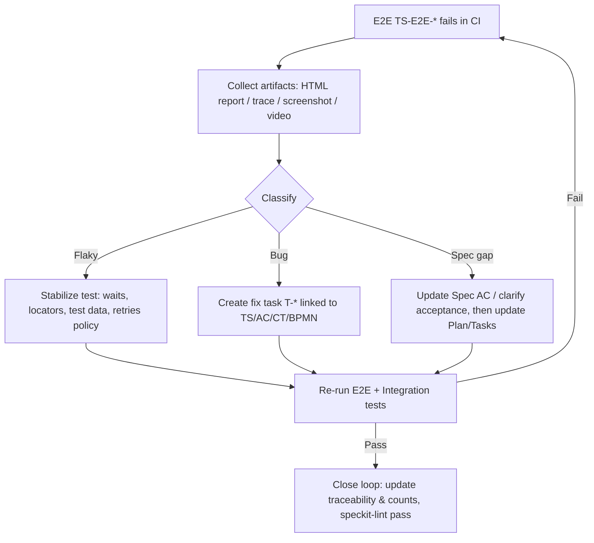

# SDD Template Pack (Tecnos v1.2.1-tecnos)

本パックは、Specification-Driven Development (SDD) を **Tecnos Japan の実務**（全社横断PJ／ERP・SCM・CRM／CBP／AgentOps／バイブコーディング）に適用するためのテンプレート一式です。

- **仕様（Spec）が一次成果物**であり、Plan/Tasks/Code は仕様からの生成物です。
- **basic_design.md** は、人間の任意テキストを受けて AI が SDD（BPMN → Spec/Plan/Tasks）へ落とす前に、認識齟齬を潰す **HITLハブ**です。
- **process.bpmn** は **Camunda 8 (Zeebe 8.8) 仕様**の BPMN 2.0 XML であり、HITL承認済みのフロー正本として扱います。

## v1.2.1-tecnos Changes（v1.2.0-tecnosからの主な変更）

### Coverage Policy（カバレッジ3層モデル）
1. **Spec Coverage（AC Coverage）= 100%必須**：全ACが少なくとも1つのTSでカバーされる
2. **Contract Coverage（CT Coverage）= 原則100%**：全CTが少なくとも1つのTS-CONでカバーされる
3. **Code Coverage = 目標値＋例外管理**：一律100%ではなく、LIB/CMPごとに適切な閾値を設定

### Tagged Acceptance Coverage（タグ付きACの種別整合）
- `integration` タグ付きACは `TS-INT-*`（統合テスト）でカバー必須
- `e2e` タグ付きACは `TS-E2E-*`（E2Eテスト）でカバー必須

### E2E Testing with Playwright（AgentOps/バイブコーディング対応）
- **二重ループ設計**：
  - **内側ループ（高速反復）**：AI＋Playwright MCPで探索・再現・テスト骨格生成・失敗解析
  - **外側ループ（品質ゲート）**：CIで決定論的にPlaywright Test（E2E）を実行しGate合否確定
- **レポート→Triage→還流**：E2E失敗時の分類（product_bug/spec_gap/test_bug/flake）と、Spec/Plan/Tasksへの還流手順を標準化

### speckit-lint 拡張
- `TAGGED_AC_NOT_COVERED_BY_REQUIRED_TEST_TYPE`：タグ付きACが対応するテスト種別でカバーされていない
- `CONTRACT_COVERAGE_INCOMPLETE`：CTが契約テストでカバーされていない
- `TEST_NOT_TASKED`：Plan上のTSがTasksにタスク化されていない
- `E2E_REPORTING_NOT_CONFIGURED`：E2Eテスト存在時にreporting設定がない

## Getting Started

| ドキュメント | 用途 | 所要時間 |
|-------------|------|----------|
| [QUICKSTART.md](./QUICKSTART.md) | 新規参画者向け最短ルート | 30分 |
| [CHEATSHEET.md](./CHEATSHEET.md) | ID規約・タグ・エラー一覧 | 参照用 |
| [MIGRATION.md](./MIGRATION.md) | v1.2.0からの移行手順 | 15分 |

## Contents

### Documentation
- `QUICKSTART.md` : クイックスタートガイド（5ステップで理解）
- `CHEATSHEET.md` : チートシート（ID規約・タグ・エラーコード一覧）
- `MIGRATION.md` : v1.2.0-tecnos → v1.2.1-tecnos 移行ガイド

### Templates
- `templates/basic_design_template.md` : HITLハブ（Human-editable Canonical YAML + Gate）
- `templates/spec_template.md` : WHAT/WHY（Canonical YAML + Spec Gate、e2eタグ対応）
- `templates/plan_template.md` : HOW（coverage_policy + tooling + reporting + E2Eテスト定義）
- `templates/tasks_template.md` : 実行可能タスク（E2E基盤・実装・triageタスク追加）

### Policies & Examples
- `policies/bpmn_generator_rules.md` : Camunda 8 (Zeebe 8.8) BPMN 2.0 生成ルール
- `examples/process_bpmn_template.bpmn` : DI付きの最小 Camunda 8 BPMN スケルトン

### Memory & Tools
- `memory/constitution.md` : Nine Articles + ID規約 + Gates（Coverage Policy参照追加）
- `memory/tecnos_org_constraints.md` : Tecnos 組織制約（E2E triage還流フロー追加）
- `tools/speckit_lint_spec.md` : speckit-lint 仕様（Tagged AC Coverage + Contract Coverage + Test Tasking検査）

## Recommended Workflow（最短導線）
1. `basic_design.md` を作成（テンプレ適用）し、#0 Canonical YAML を埋める
   - `traceability_rows` を最低1行
   - `integration_flows` を最低1件
   - ブロッキング質問（blocking=true）を 0 件に
   - `basic_design_gate_check.ready_for_bpmn = true` を立てる
2. `process.bpmn` を Camunda 8 形式で作成（または生成）し、HITL承認
   - `process_bpmn_linked = true` / `process_bpmn_approved = true`
   - 承認後に `ready_for_specify = true`
3. `spec.md` を作成し、blocking open questions を 0 にして `spec_gate_check.ai_plan_ready = true`
   - **重要**：`e2e` タグは「重要ユーザージャーニー（スモーク回帰対象）」のみに付与
4. `plan.md` を作成し、contracts/tests/phases/groups を stable id で確定して `plan_gate_check.ai_tasks_ready = true`
   - **重要**：`coverage_policy` を設定し、`covers_contract_ids` を各テストに記載
5. `tasks.md` を作成し、全タスクが plan_refs（stable id）を持つ状態にして `tasks_gate_check.tasks_ready_for_code = true`
   - **重要**：E2E基盤タスク（T-G04-001）、E2E実装タスク（T-G04-002）、triageタスク（T-G04-003）を含める
6. `speckit-lint` を回し、Gate fail を差し戻し条件として運用
   - **新規検査**：Tagged AC Coverage、Contract Coverage、Test Tasking

## Notes（Tecnos運用の前提）
- 例外（Exceptions）は必ず Constitution の Article に紐付け、`{article, reason, mitigation}` の3点セットで記録します。
- ERP/SCM/CRM 統合は「契約（Contract）・監査（Audit）・運用（Ops）・SoD（職務分掌）」を必須論点とし、`memory/tecnos_org_constraints.md` を参照します。
- AIエージェント（バイブコーディング）前提では、**CIゲートは決定論的に維持**し、MCPは生成・triage・再現に限定します。

## E2E Failure Triage Flow（標準）

