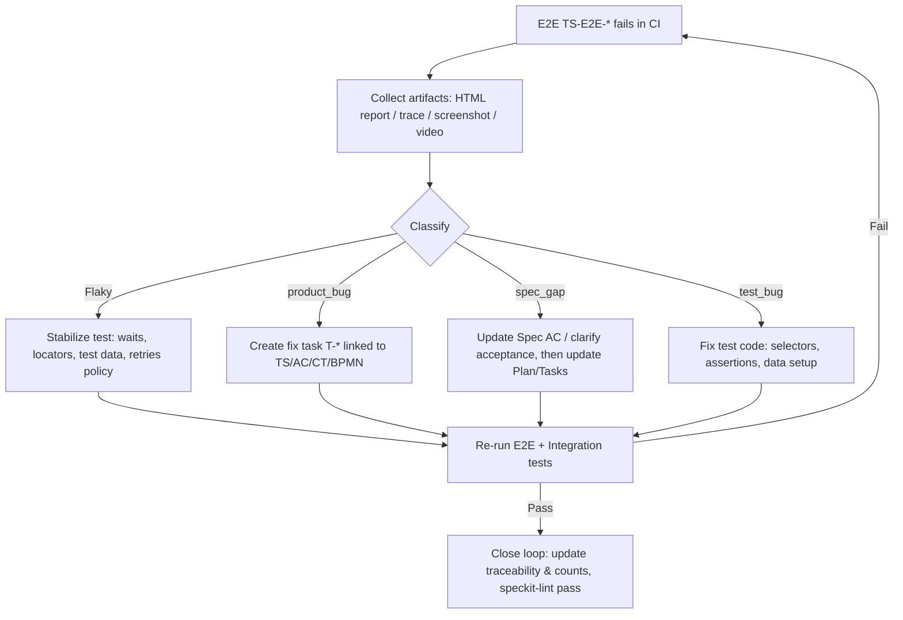

# 1. Purpose
本書は、SDDテンプレートが **Tecnos Japan の実務制約**（ERP/SCM/CRM統合、監査・運用、AI/AgentOpsガードレール、E2E品質ゲート）を自動的に取り込めるようにするための組織アドオンです。

- 本書は **Constitution（不変原則）ではない**が、Tecnosのプロジェクトでは **必須参照**とする。

# 2. Standard Enterprise Systems（代表例）
> プロジェクト固有の対象は basic_design の `systems[]` に記載すること。

- SAP（ERP）
- mcframe（生産/原価・周辺）
- Salesforce（CRM）
- Integration/ESB/iPaaS（社内標準がある場合は明記）
- IAM（SSO/ID管理）
- DWH/BI（分析基盤）

# 3. Integration Policy（統合の基本）
## 3.1 Allowed Patterns（許可）
- API（REST/OData/SOAP 等）による疎結合連携
- Event（メッセージング）による非同期連携
- File/Batch（SFTP/共有ストレージ等）※契約化・監査可能であること
- EDI / IDoc 等の標準インターフェース（採用時は契約として明文化）

## 3.2 Forbidden Patterns（原則禁止：例外はArticleに紐付けて記録）
- ERP本体DBへの直接書き込み（境界違反）
- 画面スクレイピングによる業務連携（監査・保守性リスク）
- 認証情報の平文保管、共有アカウント乱用

## 3.3 Integration Quality Baseline（最低要件）
- Correlation ID（トレースID）を統一し、ログ/監査で追跡可能にする
- Idempotency（冪等性）を、少なくとも外部入力の再送に対して担保する
- リトライ/タイムアウト/デッドレター等、失敗時の振る舞いを契約に落とす
- データ所有者（SoR: System of Record）を決める（マスタ/トランザクション単位）

# 4. Data / Security / Audit（最低要件）
## 4.1 Data Classification（分類）
- Public / Internal / Confidential / Regulated(PII・契約・財務等) を基本分類とする
- 個人情報・機微情報を扱う場合は、収集目的・保管期間・アクセス権を明記する

## 4.2 Auditability（監査可能性）
- 重要操作は監査ログ（誰が・いつ・何を・なぜ）を残す
- 職務分掌（SoD）を考慮し、権限・承認フローを設計に含める

## 4.3 Access Control（アクセス制御）
- RBAC（役割ベース）を原則とし、最小権限で設計する
- 管理者権限の濫用を防ぐ（監査・承認・緊急時手順）

# 5. Ops Baseline（運用の最低要件）
- 監視：メトリクス/ログ/トレース（いずれか欠ける場合は理由を記録）
- 障害：インシデント→ポストモーテム→Spec/Planへの還流（SDDのフィードバック）
- SLO：可用性、レイテンシ、バッチ完了時間など、対象に応じて定義する
- 変更：リリース手順・ロールバック手順をPlan/Tasksに落とす

# 6. AI / AgentOps Guardrails
- 人間の承認なしに「本番データを不可逆に変更」する自動実行は禁止（例外は記録）
- Kill switch（停止条件）を basic_design に明記する
- 生成物（Spec/Plan/Tasks/BPMN）自体が監査対象になり得るため、改訂履歴を残す

## 6.1 AI Agent Loop（バイブコーディング前提）
```yaml
agent_loop_policy:
  # 二重ループ設計
  inner_loop:
    purpose: "高速反復（探索・再現・テスト骨格生成・失敗解析）"
    tools: ["Playwright MCP", "AI Code Assistant"]
    allowed_in_ci_gate: false
  outer_loop:
    purpose: "品質ゲート（決定論的テスト実行）"
    runner: "playwright-test"
    deterministic: true
    required_for_merge: true

  # MCPの位置付け
  playwright_mcp:
    allowed_usage:
      - "explore"              # ページ探索・要素確認
      - "generate_test_skeleton"  # テスト骨格生成
      - "reproduce_failure"    # 失敗再現
      - "triage_report"        # レポート読解・修正提案
    prohibited_in_ci_gate: true  # CIゲートでは決定論的テストのみ
```

## 6.2 E2E Test Governance
- E2Eは「重要ユーザージャーニー（e2eタグ付きAC）」に限定する（Simplicity原則）
- CIゲートでは決定論的なPlaywright Testを実行する（AIエージェントの非決定性を隔離）
- E2E失敗時はレポート（HTML/trace/screenshot/video）を成果物として保存する

# 7. E2E Failure Triage & Feedback Loop（v1.2.2追加）
E2E失敗は「小さなインシデント」として扱い、Spec/Plan/Tasksへ還流する。

## 7.1 Failure Classification（分類）
| Category | Definition | Action |
|---|---|---|
| `product_bug` | プロダクトのバグ | 修正タスク（T-*）を作成し、TS/AC/CT/BPMNにリンク |
| `spec_gap` | 仕様の曖昧さ・不足 | Spec AC を更新し、Plan/Tasks を修正 |
| `test_bug` | テストコードの不具合 | テストを修正（安定セレクタ、テストデータ等） |
| `flake` | 一時的な不安定（環境依存等） | 安定化（待機戦略、リトライポリシー、テストデータ固定） |

## 7.2 Triage Flow（標準手順）


## 7.3 Triage Artifact（成果物）
- E2E導入時は `specs/<feature>/implementation-details/e2e-triage.md` を作成し、上記手順をプロジェクト固有にカスタマイズする
- 分類・担当者・還流先（Spec/Plan/Tasks）を明記する

# 8. PMO / Quality（TEIM観点の最小）
- 品質観点は少なくとも「要求・契約・テスト・運用」をカバーする
- 全社横展開が前提の成果物は、再利用可能なライブラリ/契約単位で整備する
- Coverage Policy（AC=100%、CT=原則100%、Code=目標＋例外）を遵守する

# 9. Coverage Policy Alignment（v1.2.2追加）
Org Constraints として以下のカバレッジ方針を採用する。

```yaml
coverage_policy:
  # Layer-1: Spec Coverage（必須）
  acceptance_coverage_required: true
  acceptance_coverage_target_pct: 100

  # Layer-2: Contract Coverage（原則必須）
  contract_coverage_required: true
  contract_coverage_target_pct: 100

  # Layer-3: Code Coverage（目標＋例外）
  code_coverage_targets:
    - scope: "LIB-*"
      line_pct: 85
      branch_pct: 75
      note: "ビジネスロジックは高めに"
    - scope: "CMP-*"
      line_pct: 60
      branch_pct: 50
      note: "オーケストレーション層は現実的に"
  code_coverage_exclusions:
    - path_glob: "**/generated/**"
      reason: "Generated code"
      mitigation: "Contract/Integration tests cover behavior"

  # Tagged AC enforcement
  tagged_acceptance_requirements:
    integration:
      enforce: true
      required_test_type: "integration"  # TS-INT-*
    e2e:
      enforce: true
      required_test_type: "e2e"          # TS-E2E-*
```

> End of tecnos_org_constraints.md
