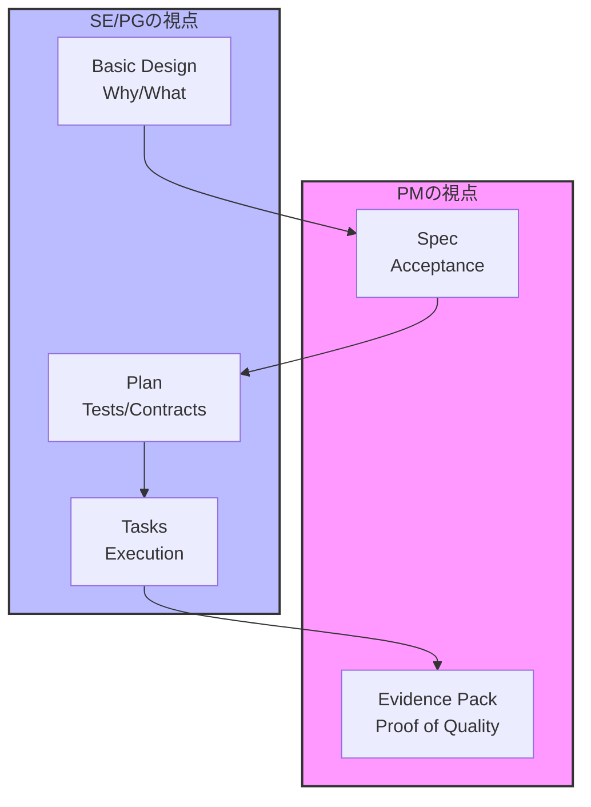

# SDD Templates 完全マニュアル - Enterprise Edition

**PMにも伝わる、実務で使えるテンプレートガイド**

---

## このマニュアルの目的

本マニュアルは、SDD（Specification-Driven Development）テンプレートの使い方を、PMにも分かる言葉で整理し、必要な部分だけ素早く把握できるようにしたものです。詳細手順は各ガイドに分離しています。

### Enterprise Edition + Tecnos-STRIDE について

**Tecnos-STRIDE Edition** は、SDD に「マイクロレベル実行追跡」と「適応的実行」を追加した拡張です。

| 機能 | 説明 | バージョン |
|------|------|-----------|
| **Epic/Feature 階層** | 大規模要件を Epic → Feature に分解、チーム横断で管理 | v2.0 |
| **3段階カバレッジ Tier** | critical/standard/experimental で品質要求を階層化 | v2.0 |
| **委任承認マトリクス** | Tier と Gate 種別に応じて承認者を自動ルーティング | v2.0 |
| **共有契約レイヤー** | チーム間 API/Event 契約を一元管理 | v2.0 |
| **二層統制モデル** | Macro Gate (1-Final) + Micro Run (WI/Run) で品質と速度を両立 | v3.0 |
| **Work Item / Mode** | risk_flags に応じた可変承認儀式 (autopilot/confirm/validate) | v3.0 |
| **Autonomy Bias** | プロジェクトの自律性嗜好に応じた適応的 Mode 判定 | v3.1 |
| **Run Resume Detection** | 中断された Run のアーティファクトから再開ポイントを自動検出 | v3.1 |
| **HTMLビジュアルダッシュボード** | 6パネルHTML（Team Health, Gate Pipeline, WI Kanban, Milestones, Risks, Dependencies） | v3.1 |
| **Execution Governance** | Auto-Continue / Mandatory Output Rules / DDD(任意) / ADR Index → [23. ガイド](18_execution_governance_guide.md) | v4.1 |
| **Turborepo Monorepo Default** | Monorepo をデフォルト化、`--scale starter/standard/enterprise` → [Appendix E](23_turborepo_monorepo.md) | v4.2 |
| **Living Spec Drift Detection** | contracts/ と src/ の乖離を自動検出（4種別: critical/high/medium） → [24. ガイド](21_spec_drift_metrics_guide.md) | v4.2 |
| **Evidence Pack Metrics** | カバレッジ・テスト結果・キャッシュヒット率・Gate リードタイムを自動収集 → [24. ガイド](21_spec_drift_metrics_guide.md) | v4.2 |
| **PR Readiness Checker** | 7チェック統合PR品質ゲート（stride-lint, spec:drift, tests, coverage, walkthrough, evidence_pack, TODO/FIXME） → [25. ガイド](22_pr_readiness_guide.md) | v4.3 |
| **AI Autonomous Execution** | AI が全作業の実行者(R)として自律実行。人間は承認者(A)として APPROVAL.md 編集のみ。lint 自動修正・承認依頼標準形式 → `CLAUDE_WORKFLOW.md` | v4.4 |
| **BDD Acceptance Criteria** | tasks.md に Given-When-Then 形式の構造化受け入れ条件を追加。`escalation_trigger` による HITL レビュー強制。BDD Lint ルール AC-001〜AC-005 → [13. ガイド](13_tasks_guide.md) | v4.5 |
| **Symphony Orchestration** | GitHub Issues → Agent 自動実行パイプライン。Phase 別エンジンルーティング（Claude Code / Codex）、並列 WI 実行、Reconciler による状態自動修復、Jinja2 プロンプトテンプレート → [30. ガイド](30_symphony_orchestration_guide.md) | v4.5 |
| **Tier Mismatch WARN** | `coverage_tier: standard` だが `security_sensitive` / `erp_integration` が true の場合、stride-lint が WARN を出力 | v4.5.1 |
| **Amendment Fast Track** | `amendment_generator.py draft --fast` で低リスク Amendment の承認を Tech Lead のみに簡略化 | v4.5.1 |
| **PM クイックスタート** | PM 向け5分ガイド — AI 自律開発の全体像と承認操作 → [00. ガイド](00_pm_quickstart.md) | v4.5.1 |
| **Execution Authority（3層権限宣言）** | AIの権限スコープを conversational / gated / prohibited の3層で宣言。mode_policy.yaml + Article XIV + wi_readiness_checker Check 8 → [17. ガイド](17_adaptive_execution_guide.md) | v4.6.0 |
| **Enterprise Hierarchy CLI Integration** | `enterprise.yaml` による有効化、`stride epic`、`stride init --epic --team`、`stride lint <path> --enterprise` / `stride lint --all --enterprise` を正式統合 → [04. ガイド](04_enterprise_guide.md) | v4.7.0 |
| **Lesson Schema 統一** | `lessons.md` の4セクション（Best Practices / Troubles / Technical / Reusable Patterns）をカテゴリプレフィックス [BP]/[TR]/[TK]/[RP] 付きで統一パース | v4.7.1 |
| **`learn` サブコマンド** | `sdd_planning_bridge.py learn` で Errors retries・Decisions・findings・lint FAIL から教訓候補を自動抽出。`--apply` で冪等に lessons.md 反映 | v4.7.1 |
| **PostToolUse Guard** | Write/Edit 後に specs/ ファイルの軽量品質チェック（YAML構文, canonical YAML, coverage_policy, plan_refs）を自動実行。fail-open | v4.7.1 |
| **Search-First 探索ラダー** | Design/Specify Phase 開始前に既存実装・過去教訓・外部パッケージ・契約整合のチェックリストを実施 | v4.7.1 |
| **Database Lifecycle Management** | `stride db` コマンド群（init/migrate/snapshot/validate）。Evidence Pack に DB スキーマ証跡を自動含有 → [31. ガイド](31_database_lifecycle_guide.md) | v4.8.0 |
| **BPMN Camunda 8.8 基盤整備** | `stride init` で `process.bpmn` 自動生成。FEAT 標準を executable `process` + `laneSet` に統一し、lint を強化（incoming/outgoing, BPMNShape/Edge, conditionExpression, documentation, YAML↔BPMN 整合） → [10. BPMN ガイド](10_bpmn_guide.md) | v4.8.0 |
| **Epic Flow BPMN** | `stride epic init` で `epic_flow.bpmn` 自動生成。`collaboration + participant(pool)` の overview 標準を追加し、`epic_validator.py` で軽量検証 + YAML↔BPMN 双方向連動チェック → [10. BPMN ガイド](10_bpmn_guide.md) | v4.8.0 |
| **BPMN 業務記述・連動強化** | `bpmn_descriptions`（FEAT）/ `epic_flow_descriptions`（EPIC）を Canonical YAML に追加。全要素に `bpmn:documentation`。YAML↔BPMN 双方向 ID 照合。`documentation` vs `textAnnotation` 使い分け標準化 → `docs/camunda_bpmn_practice_guide.md` | v4.8.0 |
| **Completeness Principle** | AI が「だいたい動く」で止めず「全ACを満たす」まで実装する思想的基盤（Boil the Lake）。SDD_MANIFESTO.md + sdd_bootstrap.md に追記 | v4.9.0 |
| **Security Audit** | `stride security --daily`（confidence >= 8 の5チェック）/ `--audit`（全10チェック）。OpenAPI security / authz_matrix / secrets / LLM trust boundary / SoD / ERP direct write guard 等 → [34. ガイド](34_security_audit_guide.md) | v4.9.0 |
| **Retrospective Report** | `stride retro` で Feature/Epic の定量ふりかえり。Phase duration / WI 統計 / テスト / lessons / bottleneck analysis → [35. ガイド](35_retro_guide.md) | v4.9.0 |
| **LLM Trust Boundary** | AI/LLM 統合時の trust boundary 4観点（boundary, input validation, output verification, fallback）を `agent_docs/security.md` に追加。SEC-006 で検証 | v4.9.0 |
| **Security Knowledge Tags** | `sdd_planning_bridge.py` の knowledge 検索で authz/sod/pii 等のリスクフラグ時にセキュリティ知識タグを自動注入 | v4.9.0 |
| **stride-lint CLI UX** | clig.dev 準拠の CLI 改善。カラー出力 / `-o ndjson` / `--plain` TSV / パス typo サジェスト / YAML 事前検証 / `suggested_action` 表示 / アクター追跡（`STRIDE_ACTOR`）/ 次ステップ提案 → [Appendix B](appendix_b_stride_lint.md) | v5.0.0 |
| **Harness Maturity** | Fowler inspired テストハーネス成熟度管理。`stride pr-check --mutation`（Check [8/8]）、`stride evaluate --review`（Self-Review Loop）、`stride health --runtime`（デッドコード・カバレッジ減衰）、`stride harness-report`（8制御インベントリ）、Symphony Janitor → [36. ガイド](36_harness_guide.md) | v5.1.0 |
| **Opus 4.7 Literal-Follow Hardening** | Governance ドキュメントを Opus 4.7 の literal instruction-following に最適化。Instruction Precedence 10段ヒエラルキー（CLAUDE.md）、lint auto-fix loop bounds（max 5 / pr-check max 3 / 3-Strike）、AI Action Boundary 3分類（MUST DO / MUST ASK / MUST NOT DO）、Completeness Principle 4条件数値基準（+100行/+3F/新AC無/新リスク無）、Task Completion 固定報告テンプレート、WI フロー 1-16 連番化 → `agent_docs/sdd_bootstrap.md` + `CLAUDE.md` | v5.2.0 |
| **`stride_shared_lib.py`** | Canonical YAML 抽出を共通ライブラリに集約（5 caller: stride_lint, multi_model_evaluator, sdd_planning_bridge, wi_readiness_checker, post_edit_guard）。8 self-tests で回帰保護 | v5.2.0 |
| **Symphony CLI 統合** | `stride symphony` を `bin/stride` から完全 dispatch（run/dispatch/status/validate/janitor の 5 subcmds）。従来の `python3 -m symphony.cli` を stride CLI 経由で統一 → [30. ガイド](30_symphony_orchestration_guide.md) | v5.2.0 |
| **Execution Authority E2E** | v4.6 Article XIV / wi_readiness Check 8 / Symphony Janitor の end-to-end 実動検証。Normal (4) + Failure (5) + Janitor (5) の 14 tests（`sdd-templates/tests/test_execution_authority_e2e.py`）→ [33. ガイド](33_integration_test_guide.md) | v5.2.0 |
| **Hermetic pytest** | `pyproject.toml` に `addopts = "-m 'not api'"` と `testpaths = [symphony/tests, tests, sdd-templates/tests]` を確定。default `pytest -q` が API 到達性不要で hermetic に（554 passed / 1 skipped / 3 deselected）| v5.2.0 |
| **Manual SSoT Consolidation** | `manual2/` を `archive/manual2-2026-04-17/` へ退避し、`manual/` を単一 SSoT に統合。`evaluator_latest.json` を `.gitignore` 化 | v5.2.0 |
| **Symphony Agent Reproducibility** | SYMPHONY.md `agent.claude_code` に `model` / `effort_level` (low/medium/high/xhigh/max) / `max_output_tokens` を明示化。ConfigLoader 検証 + runner が `--model` / `--effort` / `CLAUDE_CODE_MAX_OUTPUT_TOKENS` env 伝播 → Design/Specify/Tasking Phase の再現性確保 | v5.2.1 |
| **SEC-006 Provenance Expansion** | AI provenance 記録項目を 9 項目に拡充（provider_surface / model_id / execution_settings / budget_controls / tokenizer_notes / cyber_safeguards_status を追加）。`stride_security_checker` + `tecnos_org_constraints` + evidence_pack/plan テンプレに反映 → [34. ガイド](34_security_audit_guide.md) | v5.2.1 |
| **Linear Integration** | Run 成果物（findings / walkthrough / test_results / lessons）を Linear Issue に一元可視化する `linear_bridge.py`（urllib-based GraphQL、依存ゼロ）新設。`stride linear <init\|findings\|evidence\|learn\|sync\|close\|status>` CLI + `STRIDE_LINEAR_AUTO=1` 自動同期。LINEAR_API_KEY 未設定時 graceful skip → [37. ガイド](37_linear_integration_guide.md) | v5.3.0 |
| **Per-Project Tracker Isolation** | テンプレクローンごとに Linear Project + GitHub Project V2 を専用作成・binding。`stride linear project <create\|list\|use\|status>` + `stride project <create\|list\|use\|status>` + `stride new-project --linear-project <n> --github-project <t>`。`memory/linear.yaml` + `memory/github_project.yaml` に SSoT 永続化。未認証時 graceful skip → [37. ガイド §11](37_linear_integration_guide.md) | v5.3.1 |
| **BPMN Rule Compliance Enforcement** | `epic_flow.bpmn` / `process.bpmn` がルール通り作成されない 7 根本原因を是正。`sdd_bootstrap.md §4-BPMN` 新設（Step 1-6 MUST-DO、FEAT/EPIC 決定ツリー、14+9 Hard Requirements、lint エラーコード早見表）、`docs/bpmn_quick_reference.md` 新規、`epic_flow_template.bpmn` に `xmlns:xsi` + `isExecutable="false"` 明示、`epic_validator` 強化、`stride_lint` に sourceRef/targetRef 参照整合性チェック追加。BPMN 作成精度のみ向上、既存機能は不変 | v5.3.3 |
| **Reporting Lightening (Profile-Aware)** | 同じ STRIDE Constitution を用途別の**報告粒度** + **Completeness 閾値**で適用する Profile 軸を新設（`enterprise-erp` / `saas-integration` / `prototype`）。`basic_design.profile` が SSoT、`state.yaml` 最上位 `profile` がキャッシュ。`sdd_bootstrap.md §5` に Profile-Dependent Reporting Matrix（5-step full / critical-only / 1-line）と task-level 1-line 合成ロジック（Step 1-5 全実行前提）を追加。Completeness Principle を Profile-aware 閾値（200/150/100 行 × 5/4/3 ファイル AND）+ risk_flags 最優先「海」判定に改訂。`stride pr-check --summary-line`（project-level 1-line）/ `stride init --profile` / stride-lint `PROFILE_MISMATCH` / `PROFILE_UNKNOWN` / `PROFILE_MISSING`。**BPMN / Evidence / SEC-006 / Ops Pack / Epic-Feature Hierarchy / Coverage Tier declaration は全 Profile で現行正本のまま不変**（v5.5+ で別タスクとして検討） → [38. Profile ガイド](38_profile_guide.md) | v5.4.0 |

詳細は **[15. Enterprise Edition ガイド](04_enterprise_guide.md)** および **[16. STRIDE Playbook](27_erp_addon_playbook.md)** を参照してください。

### 対象読者

- **PM（意思決定者）**:
  - プロジェクトの品質・進捗・リスクに責任を持つ方
  - ゲート判定を行い、次工程への進行を承認する方
- **SE/PG/アーキテクト（実行者）**:
  - SDDを用いた設計・実装・テストの実務を行う方
  - 開発プロセスの改善や導入推進を担う方

## 運用補助（Claude Code / CLI）

> **v4.4 Execution Model**: Claude Code が全作業の「実行者」(R) として自律実行します。
> 人間は「承認者」(A) として APPROVAL.md の編集と業務判断のみ行います。
> 詳細は `CLAUDE_WORKFLOW.md` の「AI Autonomous Execution Rules」を参照。

- Claude Code を使う場合は `CLAUDE.md` を参照。
- CLIコマンドの正本は `agent_docs/commands.md`。

### stride CLI + STRIDE ツール

`stride` CLI に加え、v3.0 以降で STRIDE 関連ツールが追加されています：

```bash
# STRIDE ツール（v3.0/v3.1）
python3 sdd-templates/tools/wi_readiness_checker.py specs/<feature>/ <WI-ID>    # WI実行準備チェック（Autonomy Bias対応）
python3 sdd-templates/tools/run_resume_detector.py specs/<feature>/runs/<WI-ID>/RUN-NNN/  # Run中断再開検出
python3 sdd-templates/tools/erp_addon_exec_tracking.py specs/<feature>/           # ERP Addon実行追跡
python3 sdd-templates/tools/epic_progress_aggregator.py epics/<EPIC-ID>/          # Epic進捗集約（summary）
python3 sdd-templates/tools/epic_progress_aggregator.py epics/<EPIC-ID>/ --format html  # 【v3.1】HTMLビジュアルダッシュボード

# Planning Bridge（v5.0 — init/sync/evidence/learn）
python3 sdd-templates/tools/sdd_planning_bridge.py init specs/<feature>/ <WI-ID>       # .planning/ 作成（SDD 文脈付き）
python3 sdd-templates/tools/sdd_planning_bridge.py sync specs/<feature>/               # stride-lint FAIL → plan.md Errors 反映
python3 sdd-templates/tools/sdd_planning_bridge.py evidence specs/<feature>/ <WI-ID>   # walkthrough.md に Planning Evidence 挿入
python3 sdd-templates/tools/sdd_planning_bridge.py learn specs/<feature>/ <WI-ID>      # 教訓候補抽出（Errors retries, Decisions, findings）
python3 sdd-templates/tools/sdd_planning_bridge.py learn specs/<feature>/ <WI-ID> --apply  # lessons.md に直接反映（冪等）

# Spec Drift & Evidence Metrics（v4.2）
python3 sdd-templates/tools/spec_drift_detector.py .                                  # Living Spec Drift 検出
python3 sdd-templates/tools/spec_drift_detector.py . --json                            # 機械可読出力
python3 sdd-templates/tools/evidence_metrics_collector.py .                            # Evidence Metrics 収集
python3 sdd-templates/tools/evidence_metrics_collector.py . --json                     # 機械可読出力

# PR Readiness Checker（v4.3）
python3 sdd-templates/tools/pr_readiness_checker.py .                                 # 7チェック統合PR品質ゲート
python3 sdd-templates/tools/pr_readiness_checker.py . --json                           # 機械可読出力

# Security Audit（v4.9）
sdd-templates/bin/stride security specs/<feature>/ --daily                            # 軽量セキュリティチェック（confidence >= 8）
sdd-templates/bin/stride security specs/<feature>/ --audit                            # 総合セキュリティ監査（全10チェック）
sdd-templates/bin/stride security specs/<feature>/ --daily --json                     # CI/CD 連携用 JSON 出力

# Retrospective Report（v4.9）
sdd-templates/bin/stride retro specs/<feature>/                                       # Feature 定量ふりかえり
sdd-templates/bin/stride retro epics/<EPIC-ID>/                                       # Epic 横断ふりかえり
sdd-templates/bin/stride retro specs/<feature>/ --json                                # CI/CD 連携用 JSON 出力

# Process Metrics（v4.4）
python3 sdd-templates/tools/stride_process_metrics.py --feature specs/<feature> --output table  # Gate別滞留時間分析
python3 sdd-templates/tools/stride_process_metrics.py --feature specs/<feature> --update-dashboard  # PM_DASHBOARD.md 自動更新

# Symphony Orchestration（v4.5 初版 / v5.1 Janitor / v5.2 bin/stride 統合）
sdd-templates/bin/stride symphony run                                                        # ポーリングループ開始
sdd-templates/bin/stride symphony run --once                                                 # 1サイクルのみ実行
sdd-templates/bin/stride symphony run --once --dry-run                                       # シミュレーション
sdd-templates/bin/stride symphony dispatch --issue <number>                                  # 単一Issue即時ディスパッチ
sdd-templates/bin/stride symphony status                                                     # Ready Issue一覧
sdd-templates/bin/stride symphony validate                                                   # SYMPHONY.md設定検証（janitor セクション含む）
sdd-templates/bin/stride symphony janitor                                                    # Janitor 単発スキャン（v5.1）
sdd-templates/bin/stride symphony janitor --dry-run                                          # Janitor 設定・スコープ表示のみ
cat sdd-templates/templates/github-projects/labels.json | jq -c '.[]' | while read l; do gh label create "$(echo $l | jq -r .name)" --color "$(echo $l | jq -r .color)" --description "$(echo $l | jq -r .description)" --force; done  # Step1: GitHub Projects ラベル (43件)
python3 sdd-templates/tools/setup_project_labels.py --repo <owner/repo>                      # Step2: STRIDE Learning Loop ラベル (20件)
```

v1.2.4 から、統一された `stride` CLI が利用できます：

```bash
# PATHに追加
export PATH="$PATH:$(pwd)/sdd-templates/bin"

# 主要コマンド
stride init my_feature          # 機能を初期化（全テンプレート作成）
stride init --lite my_feature   # Lite Mode で初期化
stride lint specs/my_feature/ --warn-only  # 仕様を検証（初回推奨）
stride phase-status             # Phase Gate 状況を表示
stride hooks                    # Phase Gate hooks を設定
```

詳細は [10. stride-lint 使用ガイド](appendix_b_stride_lint.md) を参照。

---

**同梱サンプル**: `sdd-templates/specs/sample_feature` に Web-EDI の参考サンプルがあります（未承認/プレースホルダあり）。Enterprise の実動サンプルは `epics/EPIC-SAMPLE/` と `specs/FEAT-ERPSAMPLE/` を参照してください。

## まず結論（3分サマリー）

### 1) 何が変わるか

- 仕様が「唯一の正本」になるため、認識ズレと手戻りが減る
- 品質・監査・AI利用の統制が、ドキュメントとゲートで見える化される
- 承認と責任の所在が明確になり、説明責任を果たしやすくなる

### 2) PMが見るべき成果物

| 成果物 | 役割 | PMが見るポイント |
|---|---|---|
| `basic_design.md` | 目的の合意書 | 目的・範囲・期待効果が明確か |
| `spec.md` | 仕様の正本 | 受入条件（AC）が客観的か |
| `plan.md` | 実行計画 | リスク・テスト・依存関係が説明されているか |
| `tasks.md` | 作業計画 | 作業が抜け漏れなく分解されているか |
| `evidence_pack.md` | 品質証跡 | ゲート通過と証跡が揃っているか |

※ `process.bpmn` は単一 Feature の実装フロー、`epic_flow.bpmn` はチーム間・システム間の概観です。必要に応じて両方を確認します。

### 3) PMが決めること

- 対象範囲（どの案件からSDDを適用するか）
- 承認者（誰がGateを通すか）
- 品質基準（Evidence Packで何を残すか）
- AI利用のルール（AIは責任者になれない）

### 4) 成功/失敗のサイン

- 成功の兆候: ゲートが順に通過している、証跡が揃っている、仕様と実装の差分が少ない
- 失敗の兆候: 仕様が空白、承認が曖昧、テスト/証跡が後付け

---

## 用語を一言で言うと

- **basic_design**: 何をやるかの合意書
- **spec**: 仕様の契約書（受入条件が入る）
- **plan**: 実装の工程表
- **tasks**: 実行手順（作業分解）
- **evidence_pack**: 監査・品質の証拠箱
- **Gate**: 「次へ進んでよいか」の通過判定

---

## 📝 「契約（Contract）」とは何か

### SDDにおける「契約」の意味

SDDで使う「契約」は**法的な契約書ではありません**。
**システム同士が通信するときの「約束事」を文書化したもの**です。

```
┌─────────────────────────────────────────────────────────────────────────────┐
│                                                                             │
│   「契約」= システム間の通信ルールを明文化したもの                          │
│                                                                             │
│   ┌──────────┐                              ┌──────────┐                    │
│   │          │   ① リクエスト               │          │                    │
│   │  システム │  ───────────────────────→   │  システム │                    │
│   │    A     │   「POST /orders」           │    B     │                    │
│   │          │                              │          │                    │
│   │          │   ② レスポンス               │          │                    │
│   │          │  ←───────────────────────    │          │                    │
│   └──────────┘   「{orderNumber: ...}」     └──────────┘                    │
│                                                                             │
│   この「①どう呼ぶか」「②どう返すか」のルールが「契約」                      │
│                                                                             │
└─────────────────────────────────────────────────────────────────────────────┘
```

### なぜ「契約」と呼ぶのか

| 法的な契約 | SDDの契約 |
|-----------|----------|
| 当事者間の約束を文書化 | システム間の約束を文書化 |
| 破ると法的責任 | 破るとシステム障害 |
| 双方が合意してから有効 | 双方が実装してから有効 |
| 契約書で管理 | OpenAPI/JSON Schema等で管理 |

**共通点**: どちらも「約束を明文化し、守ることを保証する」という点で同じです。

### 契約の具体例

```
┌─────────────────────────────────────────────────────────────────────────────┐
│                                                                             │
│  例1: API契約（CT-API-*）                                                   │
│  ─────────────────────────────────────────────────────────────────────      │
│  「POST /orders を呼ぶと、受注番号がJSON形式で返る」                         │
│                                                                             │
│  ・リクエスト: POST /orders                                                 │
│  ・レスポンス: { "orderNumber": "SO-2025-000123" }                          │
│  ・エラー: 認証なし → 401、権限なし → 403                                   │
│                                                                             │
│  → これをOpenAPI形式で文書化したものが「API契約」                           │
│                                                                             │
├─────────────────────────────────────────────────────────────────────────────┤
│                                                                             │
│  例2: イベント契約（CT-EVT-*）                                              │
│  ─────────────────────────────────────────────────────────────────────      │
│  「注文が作成されたら、OrderCreatedイベントをKafkaに送る」                   │
│                                                                             │
│  ・トピック: orders.created                                                 │
│  ・ペイロード: { "orderId": "123", "partnerCode": "P-1001", "total": 1000 } │
│                                                                             │
│  → これをAsyncAPI/JSON Schema形式で文書化したものが「イベント契約」         │
│                                                                             │
├─────────────────────────────────────────────────────────────────────────────┤
│                                                                             │
│  例3: ファイル契約（CT-FILE-*）                                             │
│  ─────────────────────────────────────────────────────────────────────      │
│  「毎日0時に、受注CSVをSFTPサーバーに配置する」                              │
│                                                                             │
│  ・ファイル名: orders_YYYYMMDD.csv                                          │
│  ・文字コード: UTF-8                                                        │
│  ・区切り: カンマ                                                           │
│  ・ヘッダー: order_id,partner_code,amount,created_at                        │
│                                                                             │
│  → これを文書化したものが「ファイル契約」                                   │
│                                                                             │
├─────────────────────────────────────────────────────────────────────────────┤
│                                                                             │
│  例4: CLI契約（CT-CLI-*）                                                   │
│  ─────────────────────────────────────────────────────────────────────      │
│  「mycli export --format json と打つと、データがJSON形式で出力される」      │
│                                                                             │
│  ・コマンド: mycli export                                                   │
│  ・オプション: --format (json|csv|xml)                                      │
│  ・出力: 標準出力にデータを出力                                             │
│  ・終了コード: 成功=0、エラー=1                                             │
│                                                                             │
│  → これを文書化したものが「CLI契約」                                        │
│                                                                             │
└─────────────────────────────────────────────────────────────────────────────┘
```

### 契約の種類一覧

| 種別 | ID形式 | 用途 | 例 |
|------|--------|------|-----|
| API契約 | CT-API-* | REST/GraphQL/gRPC | 受注受付API |
| CLI契約 | CT-CLI-* | コマンドラインツール | データエクスポートコマンド |
| イベント契約 | CT-EVT-* | Kafka/EventHub/SQS | 注文作成イベント |
| ファイル契約 | CT-FILE-* | SFTP/S3ファイル連携 | 日次受注CSV連携 |
| バッチ契約 | CT-BATCH-* | バッチ処理 | 月次集計バッチ |
| EDI契約 | CT-EDI-* | 企業間データ交換 | 受注データ連携 |
| IDoc契約 | CT-IDOC-* | SAP連携 | SAP受注連携 |

### 契約テスト（TS-CON-*）とは

契約を定義したら、それが守られているかを確認するテストが必要です。
これが「契約テスト」です。

```
┌─────────────────────────────────────────────────────────────────────────────┐
│                                                                             │
│  契約テストの役割                                                           │
│                                                                             │
│  ┌──────────────┐      ┌──────────────┐      ┌──────────────┐              │
│  │              │      │              │      │              │              │
│  │   契約定義   │ ───→ │  契約テスト  │ ───→ │   実装      │              │
│  │  (CT-API-01) │      │  (TS-CON-01) │      │   コード    │              │
│  │              │      │              │      │              │              │
│  └──────────────┘      └──────────────┘      └──────────────┘              │
│                                                                             │
│  ・契約テストは「契約通りに動くか」を検証する                               │
│  ・契約が変わったら、テストも更新する                                       │
│  ・テストが通れば、契約は守られている                                       │
│                                                                             │
└─────────────────────────────────────────────────────────────────────────────┘
```

### なぜ契約を先に定義するのか（Contract-First）

```
┌─────────────────────────────────────────────────────────────────────────────┐
│                                                                             │
│  ❌ よくある失敗パターン（実装先行）                                        │
│  ─────────────────────────────────────────────────────────────────────      │
│                                                                             │
│  1. Aチームが実装開始 → 「/api/orders で返すね」                            │
│  2. Bチームも実装開始 → 「/api/order にしよう」（微妙に違う）               │
│  3. 結合時に発覚 → 「えっ、orders じゃなくて order？」                      │
│  4. 手戻り発生 → どちらかが修正                                             │
│                                                                             │
│  ────────────────────────────────────────────────────────────────────       │
│                                                                             │
│  ✅ SDDのやり方（契約先行）                                                 │
│  ─────────────────────────────────────────────────────────────────────      │
│                                                                             │
│  1. まず契約を定義 → 「CT-API-01: POST /api/orders」                        │
│  2. 契約テストを作成 → 「TS-CON-01: CT-API-01 をカバー」                    │
│  3. Aチーム・Bチームとも契約に従って実装                                    │
│  4. 結合時に問題なし → 契約が守られているから                               │
│                                                                             │
└─────────────────────────────────────────────────────────────────────────────┘
```

**ポイント**: 契約を先に決めることで、チーム間の認識ズレを防ぎ、結合時の手戻りを減らせます。

---

## 🎯 テンプレート連携の全体像：要望からプログラム完成まで

### なぜテンプレートが連携するのか

SDDでは、**「要望」から「動くプログラム」までを一本の糸で繋ぎます**。この糸を「トレーサビリティ」と呼びます。

```
┌─────────────────────────────────────────────────────────────────────────┐
│                     トレーサビリティの流れ                                │
│                                                                          │
│  「取引先がほしいもの」→「仕様」→「設計」→「コード」→「テスト」→「証跡」 │
│                                                                          │
│  すべてがIDで紐付き、どこからでも「なぜこれが必要か」を追跡できる         │
└─────────────────────────────────────────────────────────────────────────┘
```

### 5つのテンプレートの役割と連携

```
┌─────────────────────────────────────────────────────────────────────────────┐
│                                                                             │
│   ① basic_design.md                                                        │
│   ┌─────────────────────────────────────────────────────────────┐          │
│   │ 「何を作るか」の合意                                        │          │
│   │                                                             │          │
│   │  ・目的（なぜ作るか）                                       │          │
│   │  ・スコープ（どこまで作るか）                               │          │
│   │  ・要件（RQ-001, RQ-002...）                                │          │
│   │  ・制約（技術/組織/コスト）                                 │          │
│   │  ・統合フロー（FLOW-001...）                                │          │
│   └─────────────────────────────────────────────────────────────┘          │
│            │                                                               │
│            │ RQ-* を受け取り、US/AC に展開                                 │
│            ▼                                                               │
│   ② spec.md                                                                │
│   ┌─────────────────────────────────────────────────────────────┐          │
│   │ 「どう動けば正解か」の定義                                  │          │
│   │                                                             │          │
│   │  ・ユースケース（US-FEAT001-001, US-FEAT001-002...）        │          │
│   │  ・受入条件（AC-US-FEAT001-001-01, AC-US-FEAT001-001-02...）│          │
│   │  ・非機能要件（性能/セキュリティ/運用）                     │          │
│   │  ・Spec-as-Code（OpenAPI, 移行マッピング等）                │          │
│   └─────────────────────────────────────────────────────────────┘          │
│            │                                                               │
│            │ AC-* を受け取り、CT/TS でカバー                               │
│            ▼                                                               │
│   ③ plan.md                                                                │
│   ┌─────────────────────────────────────────────────────────────┐          │
│   │ 「どう作り、どう検証するか」の設計                          │          │
│   │                                                             │          │
│   │  ・アーキテクチャ（CMP-01, LIB-01...）                      │          │
│   │  ・契約定義（CT-API-01, CT-EVT-01...）                      │          │
│   │  ・テスト計画（TS-CON-01, TS-INT-01, TS-E2E-01...）         │          │
│   │  ・カバレッジポリシー（AC 100%, CT 100%）                   │          │
│   │  ・作業グループ（G-01-contracts, G-02-impl...）             │          │
│   └─────────────────────────────────────────────────────────────┘          │
│            │                                                               │
│            │ G-*, TS-*, CT-* を受け取り、タスクに分解                      │
│            ▼                                                               │
│   ④ tasks.md                                                               │
│   ┌─────────────────────────────────────────────────────────────┐          │
│   │ 「誰が何をいつやるか」の実行計画                            │          │
│   │                                                             │          │
│   │  ・タスク（T-G01-001, T-G01-002, T-G02-001...）             │          │
│   │  ・依存関係（T-G02-001 は T-G01-001 完了後）                │          │
│   │  ・マイルストーン（M-01: 契約確定, M-02: 実装完了...）      │          │
│   │  ・plan_refs（各タスクがPlanのどこを実現するか）            │          │
│   └─────────────────────────────────────────────────────────────┘          │
│            │                                                               │
│            │ タスク実行 → 実装 → テスト実行 → 証跡収集                     │
│            ▼                                                               │
│   ⑤ evidence_pack.md                                                       │
│   ┌─────────────────────────────────────────────────────────────┐          │
│   │ 「やった証拠」の集積                                        │          │
│   │                                                             │          │
│   │  ・CIログ（ビルド/テスト結果）                              │          │
│   │  ・SAST/SCA結果（セキュリティ検査）                         │          │
│   │  ・カバレッジレポート（AC/CT/Code）                         │          │
│   │  ・AIプロヴェナンス（AI生成コードの出自）                   │          │
│   │  ・承認記録（誰がいつ承認したか）                           │          │
│   └─────────────────────────────────────────────────────────────┘          │
│                                                                             │
└─────────────────────────────────────────────────────────────────────────────┘
```

Enterprise / Multi-Team では、これに加えて `epics/<EPIC>/epic_flow.bpmn` を Epic overview（`collaboration + participant(pool)`）として管理します。

---

## 🔗 テンプレート間のデータフロー（具体例）

### 例：Web-EDI受注受付

以下は、1つの機能がテンプレートを通じてどう繋がるかの最小例です。

#### Step 1: basic_design.md（目的と要件）

```yaml
basic_design:
  traceability_rows:
    - rq: { id: "RQ-001", statement: "Web-EDIで発注後、5分以内に受注番号と納期回答を返す" }
      us: { id: "US-FEAT001-001", title: "Web-EDI発注送信" }
      ac:
        id: "AC-US-FEAT001-001-01"
        statement: "取引先ID「P-1001」で発注CSV(10行)を送信すると、60秒以内に受注番号が表示される"
        tags: ["integration"]
  integration_flows:
    - id: "FLOW-001"
      name: "Web-EDI受注受付フロー"
      summary: "Web-EDI → ERP登録 → 受注番号/納期回答"
```

#### Step 2: spec.md（ユースケースと受入条件）

```yaml
spec:
  use_cases:
    - id: "US-FEAT001-001"
      title: "Web-EDI発注送信"
      acceptance:
        - id: "AC-US-FEAT001-001-01"
          statement: "発注CSV(10行)を送信すると、60秒以内に受注番号が表示される"
          tags: ["integration"]
        - id: "AC-US-FEAT001-001-02"
          statement: "在庫不足の場合、納期回答日が表示される"
          tags: ["e2e"]
```

#### Step 3: plan.md（契約とテスト）

```yaml
plan:
  contracts:
    apis_events:
      - id: "CT-API-01"
        name: "Web-EDI受注受付API"
      - id: "CT-API-02"
        name: "ERP受注登録API"
  test_strategy:
    tests:
      - id: "TS-CON-01"
        type: "contract"
        covers_contract_ids: ["CT-API-01"]
      - id: "TS-INT-01"
        type: "integration"
        covers_acceptance_ids: ["AC-US-FEAT001-001-01"]
      - id: "TS-E2E-01"
        type: "e2e"
        covers_acceptance_ids: ["AC-US-FEAT001-001-02"]
```

#### Step 4: tasks.md（作業化）

```yaml
tasks:
  tasks:
    - id: "T-G01-001"
      title: "Define interface contract (CT-API-01)"
      plan_refs: ["CT-API-01", "TS-CON-01"]
    - id: "T-G03-001"
      title: "Write integration tests (TS-INT-01)"
      plan_refs: ["TS-INT-01"]
```

#### Step 5: evidence_pack.md（証跡）

```yaml
Gate:
  Decision: "合格"

Required Evidence:
  - ci_results: "https://ci.example.com/..."
  - test_reports: "sdd-templates/specs/sample_feature/tests/reports/"
  - sast: "https://sonar.example.com/..."
  - sca: "https://snyk.example.com/..."
```

---

## 📊 IDによるトレーサビリティの連鎖

### 「なぜこのコードが必要か」を追跡できる

```
┌─────────────────────────────────────────────────────────────────────────────┐
│                                                                             │
│  コード: OrderRegistrationService.java                                      │
│         │                                                                   │
│         │ どのタスクで作成？                                                │
│         ▼                                                                   │
│  タスク: T-G02-001 "受注登録ロジックを実装"                                 │
│         │                                                                   │
│         │ plan_refs は？                                                    │
│         ▼                                                                   │
│  計画: LIB-01 (OrderRegistrationLib)                                        │
│         │                                                                   │
│         │ どのテストでカバー？                                              │
│         ▼                                                                   │
│  テスト: TS-INT-01 (統合テスト)                                             │
│         │                                                                   │
│         │ covers_acceptance_ids は？                                        │
│         ▼                                                                   │
│  受入条件: AC-US-FEAT001-001-01 "発注CSV(10行)を送信すると、60秒以内に受注番号が表示される" │
│         │                                                                   │
│         │ どのユースケース？                                                │
│         ▼                                                                   │
│  ユースケース: US-FEAT001-001 "Web-EDI発注送信"                              │
│         │                                                                   │
│         │ requirement_refs は？                                             │
│         ▼                                                                   │
│  要件: RQ-001 "Web-EDIで発注後、5分以内に受注番号と納期回答を返す"           │
│         │                                                                   │
│         │ 誰のため？                                                        │
│         ▼                                                                   │
│  ビジネス目的: 「取引先の受注入力を短縮し、誤入力を減らす」                 │
│                                                                             │
└─────────────────────────────────────────────────────────────────────────────┘
```

**これがトレーサビリティの力です**。どのコードも、最終的には「なぜ必要か」まで追跡できます。

---

## 🚪 ゲートシステム：品質の関門

### 5つのゲートと通過条件

```
┌─────────────────────────────────────────────────────────────────────────────┐
│                                                                             │
│  Gate 1: Basic Design Gate                                                  │
│  ┌───────────────────────────────────────────────────────────────────┐      │
│  │ ✓ 目的/スコープ/制約が明確                                        │      │
│  │ ✓ 統合フロー（FLOW-*）が1件以上                                   │      │
│  │ ✓ blocking質問が0件                                               │      │
│  │ ✓ 納品形態（delivery_model）が決定                                │      │
│  │ ✓ RACI+（責任分担）が設定                                         │      │
│  └───────────────────────────────────────────────────────────────────┘      │
│                          │                                                  │
│                          ▼ Pass → BPMNフェーズへ                            │
│  Gate 2: BPMN Approval Gate                                                 │
│  ┌───────────────────────────────────────────────────────────────────┐      │
│  │ ✓ process.bpmn が作成済み                                         │      │
│  │ ✓ Camunda 8形式（incoming/outgoing必須）                          │      │
│  │ ✓ 承認者が明記され承認済み                                        │      │
│  └───────────────────────────────────────────────────────────────────┘      │
│  │ Enterprise / Multi-Team では Epic overview として                 │      │
│  │ epic_flow.bpmn を別管理し、stride epic validate で検証            │      │
│                          │                                                  │
│                          ▼ Pass → Specフェーズへ                            │
│  Gate 3: Spec Gate                                                          │
│  ┌───────────────────────────────────────────────────────────────────┐      │
│  │ ✓ ユースケース（US-*）が1件以上                                   │      │
│  │ ✓ 受入条件（AC-*）が3件以上                                       │      │
│  │ ✓ integration タグ付きACが1件以上                                 │      │
│  │ ✓ 非機能要件（NFR）が6カテゴリ以上                                │      │
│  │ ✓ Spec-as-Code（OpenAPI等）が定義済み                             │      │
│  │ ✓ blocking質問が0件                                               │      │
│  └───────────────────────────────────────────────────────────────────┘      │
│                          │                                                  │
│                          ▼ Pass → Planフェーズへ                            │
│  Gate 4: Plan Gate                                                          │
│  ┌───────────────────────────────────────────────────────────────────┐      │
│  │ ✓ 契約（CT-*）が1件以上                                           │      │
│  │ ✓ テスト（TS-*）が2件以上                                         │      │
│  │ ✓ 統合テスト（TS-INT-*）が1件以上                                 │      │
│  │ ✓ 作業グループ（G-*）が3件以上                                    │      │
│  │ ✓ カバレッジポリシーが定義済み                                    │      │
│  │ ✓ Evidence Packが定義済み                                         │      │
│  └───────────────────────────────────────────────────────────────────┘      │
│                          │                                                  │
│                          ▼ Pass → Tasksフェーズへ                           │
│  Gate 5: Tasks Gate                                                         │
│  ┌───────────────────────────────────────────────────────────────────┐      │
│  │ ✓ タスク（T-*）が5件以上                                          │      │
│  │ ✓ 全テスト（TS-*）がタスクに紐付いている                          │      │
│  │ ✓ 循環依存がない                                                  │      │
│  │ ✓ plan_refs が stable ID のみ                                     │      │
│  └───────────────────────────────────────────────────────────────────┘      │
│                          │                                                  │
│                          ▼ Pass → 実装開始                                  │
│                                                                             │
└─────────────────────────────────────────────────────────────────────────────┘
```

### ❓ なぜ「blocking質問」が複数のGateにあるのか

Gate 1（Basic Design）とGate 3（Spec）の両方に「blocking質問が0件」という条件があります。これは冗長ではなく、**フェーズごとに異なるレベルの疑問が発生する**ためです。

#### フェーズによる質問レベルの違い

| フェーズ | 質問のレベル | 例 |
|---------|-------------|-----|
| Gate 1 (Basic Design) | **戦略的**な質問 | 対象顧客は？予算は？スコープは？ |
| Gate 3 (Spec) | **戦術的**な質問 | エラー処理は？タイムアウトは？バリデーションルールは？ |

#### 具体例

```
┌─────────────────────────────────────────────────────────────────────────────┐
│                                                                             │
│  Gate 1: Basic Design（目的・範囲の合意）                                   │
│  ──────────────────────────────────────────────────────────────────         │
│                                                                             │
│  Q-001: 「この機能は国内向けか、海外向けか？」                              │
│         → blocking: true（これが決まらないと範囲が決まらない）              │
│                                                                             │
│  ✅ Q-001 が解決 → Gate 1 通過                                              │
│                                                                             │
├─────────────────────────────────────────────────────────────────────────────┤
│                                                                             │
│  Gate 3: Spec（詳細仕様の確定）                                             │
│  ──────────────────────────────────────────────────────────────────         │
│                                                                             │
│  詳細を詰める中で、新たな疑問が発生：                                       │
│                                                                             │
│  Q-003: 「エラー時の再試行は何回まで？」                                    │
│         → blocking: true（これが決まらないとACが書けない）                  │
│                                                                             │
│  Q-004: 「タイムアウトは何秒？」                                            │
│         → blocking: true（NFRに必要）                                       │
│                                                                             │
│  ❌ Q-003, Q-004 が未解決 → Gate 3 通過できない                              │
│                                                                             │
└─────────────────────────────────────────────────────────────────────────────┘
```

#### blocking質問の効果

```
┌─────────────────────────────────────────────────────────────────────────────┐
│                                                                             │
│  ❌ blocking質問がないと起きること                                          │
│  ──────────────────────────────────────────────────────────────────         │
│                                                                             │
│  1. 「まあ後で決めればいいか」と曖昧なまま進む                              │
│  2. 実装フェーズで「あれ、どっちだっけ？」となる                            │
│  3. 開発者が勝手に判断 → レビューで「それ違う」                             │
│  4. 手戻り発生 💥                                                           │
│                                                                             │
├─────────────────────────────────────────────────────────────────────────────┤
│                                                                             │
│  ✅ blocking質問があると                                                    │
│  ──────────────────────────────────────────────────────────────────         │
│                                                                             │
│  1. 「これが決まらないと進めません」と明示できる                            │
│  2. 関係者に回答を促せる（owner + due で責任明確）                          │
│  3. 曖昧さを残したまま次フェーズに進むことを防止                            │
│  4. 手戻りを未然に防ぐ 🛡️                                                   │
│                                                                             │
└─────────────────────────────────────────────────────────────────────────────┘
```

#### blocking: true と false の使い分け

| フラグ | 意味 | 例 |
|-------|------|-----|
| `blocking: true` | これが解決するまで次に進んではいけない | 「認証方式はOAuthかJWTか？」 |
| `blocking: false` | 後で決めても進行に支障なし | 「UIのボタン色は？」 |

**ポイント**: 「決めるべきことを決めてから進む」— これがSDDのGateシステムの本質です。

---

## 🔄 開発サイクルの流れ

### 開発アプローチ別の所要時間比較

SDDの各フェーズにかかる時間は、開発アプローチによって大きく異なります。

| Phase | 作業内容 | 従来開発 | AI支援開発 | ボトルネック |
|-------|---------|---------|-----------|-------------|
| Phase 1 | 認識合わせ | 1-2週間 | 1-2日 | 人間の承認・合意形成 |
| Phase 2 | BPMN作成 | 1週間 | 数時間-1日 | ステークホルダー確認 |
| Phase 3 | 仕様定義 | 1-2週間 | 1-2日 | 人間のレビュー・承認 |
| Phase 4 | 実装計画 | 1週間 | 数時間-1日 | 人間のレビュー・承認 |
| Phase 5 | タスク分解 | 1週間 | 数時間 | 人間の確認 |
| Phase 6 | 実装・テスト | 2-4週間 | 2-5日 | 人間のレビュー・テスト確認 |
| Phase 7 | 証跡収集 | 1週間 | 数時間 | CI/CD実行時間 |
| **合計** | | **8-12週間** | **1-2週間** | |

#### 従来開発（人間のみ）

- ドキュメント作成、コーディング、テスト作成をすべて人間が実施
- 各フェーズで作業時間 + レビュー時間 + 修正時間が発生
- 複数人のスケジュール調整が必要

#### AI支援開発（Claude Code等）

- ドキュメント・コード・テストの初稿をAIが数分〜数時間で生成
- 人間は**レビューと承認に集中**できる
- ボトルネックは「AIの作業速度」から「人間の判断速度」へシフト

```
┌─────────────────────────────────────────────────────────────────────────────┐
│                                                                             │
│  【従来開発】                        【AI支援開発】                          │
│                                                                             │
│   作成 ████████████  80%             作成 ██  10%                           │
│   レビュー ██  10%                    レビュー ████████  70%                 │
│   承認 █  5%                          承認 ██  15%                           │
│   その他 █  5%                        その他 █  5%                           │
│                                                                             │
│   → 作成に時間がかかる                → レビュー・承認が中心                 │
│                                                                             │
└─────────────────────────────────────────────────────────────────────────────┘
```

> **注意**: AI支援開発でも、**人間による承認（APPROVAL.md）は必須**です。
> AIが作成したドキュメントやコードを、責任者が確認・承認するプロセスは省略できません。

---

### フェーズごとの作業と成果物

```
┌─────────────────────────────────────────────────────────────────────────────┐
│                                                                             │
│  Phase 1: 認識合わせ                                                        │
│  従来: 1-2週間 ｜ AI支援: 1-2日（承認待ち含む）                                             │
│  ════════════════════════════════════════════════════════════════════       │
│                                                                             │
│  INPUT:  業務要望、ヒアリング結果                                           │
│                     │                                                       │
│                     ▼                                                       │
│  作業:   basic_design.md を作成                                             │
│          ├─ 目的/スコープを整理                                             │
│          ├─ 要件（RQ-*）を列挙                                              │
│          ├─ 統合フロー（FLOW-*）を設計                                      │
│          └─ 制約/前提条件を明確化                                           │
│                     │                                                       │
│                     ▼                                                       │
│  OUTPUT: basic_design.md (Gate 1 通過)                                      │
│                                                                             │
│  ────────────────────────────────────────────────────────────────────       │
│                                                                             │
│  Phase 2: 業務フロー可視化                                                  │
│  従来: 1週間 ｜ AI支援: 数時間-1日                                          │
│  ════════════════════════════════════════════════════════════════════       │
│                                                                             │
│  INPUT:  basic_design.md の統合フロー                                       │
│                     │                                                       │
│                     ▼                                                       │
│  作業:   process.bpmn を作成                                                │
│          ├─ BPMN 2.0 形式で業務フローを図示                                 │
│          ├─ Camunda 8 形式（incoming/outgoing必須）                         │
│          └─ ステークホルダーと合意                                          │
│                     │                                                       │
│                     ▼                                                       │
│  OUTPUT: process.bpmn (Gate 2 通過)                                         │
│                                                                             │
│  ────────────────────────────────────────────────────────────────────       │
│                                                                             │
│  Phase 3: 仕様定義                                                          │
│  従来: 1-2週間 ｜ AI支援: 1-2日                                             │
│  ════════════════════════════════════════════════════════════════════       │
│                                                                             │
│  INPUT:  basic_design.md の RQ-*, FLOW-*                                    │
│                     │                                                       │
│                     ▼                                                       │
│  作業:   spec.md を作成                                                     │
│          ├─ ユースケース（US-*）を定義                                      │
│          ├─ 受入条件（AC-*）を定義（タグ付き）                              │
│          ├─ 非機能要件（NFR）を定義                                         │
│          └─ Spec-as-Code（OpenAPI等）を作成                                 │
│                     │                                                       │
│                     ▼                                                       │
│  OUTPUT: spec.md + contracts/openapi.yaml (Gate 3 通過)                     │
│                                                                             │
│  ────────────────────────────────────────────────────────────────────       │
│                                                                             │
│  Phase 4: 実装計画                                                          │
│  従来: 1週間 ｜ AI支援: 数時間-1日                                          │
│  ════════════════════════════════════════════════════════════════════       │
│                                                                             │
│  INPUT:  spec.md の US-*, AC-*                                              │
│                     │                                                       │
│                     ▼                                                       │
│  作業:   plan.md を作成                                                     │
│          ├─ アーキテクチャ（CMP-*, LIB-*）を設計                            │
│          ├─ 契約（CT-*）を定義                                              │
│          ├─ テスト（TS-*）を計画（AC/CTをカバー）                           │
│          ├─ カバレッジポリシーを設定                                        │
│          └─ 作業グループ（G-*）を定義                                       │
│                     │                                                       │
│                     ▼                                                       │
│  OUTPUT: plan.md (Gate 4 通過)                                              │
│                                                                             │
│  ────────────────────────────────────────────────────────────────────       │
│                                                                             │
│  Phase 5: タスク分解                                                        │
│  従来: 1週間 ｜ AI支援: 数時間                                              │
│  ════════════════════════════════════════════════════════════════════       │
│                                                                             │
│  INPUT:  plan.md の G-*, CT-*, TS-*, CMP-*, LIB-*                           │
│                     │                                                       │
│                     ▼                                                       │
│  作業:   tasks.md を作成                                                    │
│          ├─ タスク（T-*）を定義（plan_refs で紐付け）                       │
│          ├─ 依存関係（depends_on）を設定                                    │
│          ├─ マイルストーン（M-*）を設定                                     │
│          └─ 担当者/期限を設定                                               │
│                     │                                                       │
│                     ▼                                                       │
│  OUTPUT: tasks.md (Gate 5 通過)                                             │
│                                                                             │
│  ────────────────────────────────────────────────────────────────────       │
│                                                                             │
│  Phase 6: 実装・テスト                                                      │
│  従来: 2-4週間 ｜ AI支援: 2-5日                                             │
│  ════════════════════════════════════════════════════════════════════       │
│                                                                             │
│  INPUT:  tasks.md のタスク一覧                                              │
│                     │                                                       │
│                     ▼                                                       │
│  作業:   タスクを順次実行                                                   │
│          ├─ 契約テスト（TS-CON-*）を実装・実行                              │
│          ├─ ライブラリ（LIB-*）を実装                                       │
│          ├─ コンポーネント（CMP-*）を実装                                   │
│          ├─ 統合テスト（TS-INT-*）を実行                                    │
│          └─ E2Eテスト（TS-E2E-*）を実行                                     │
│                     │                                                       │
│                     ▼                                                       │
│  OUTPUT: 実装コード + テスト結果                                            │
│                                                                             │
│  ────────────────────────────────────────────────────────────────────       │
│                                                                             │
│  Phase 7: 証跡収集                                                          │
│  従来: 1週間 ｜ AI支援: 数時間                                              │
│  ════════════════════════════════════════════════════════════════════       │
│                                                                             │
│  INPUT:  CI結果、テスト結果、セキュリティスキャン結果                       │
│                     │                                                       │
│                     ▼                                                       │
│  作業:   evidence_pack.md を作成                                            │
│          ├─ CI結果を記録                                                    │
│          ├─ テスト結果を記録                                                │
│          ├─ カバレッジレポートを記録                                        │
│          ├─ SAST/SCA結果を記録                                              │
│          ├─ AIプロヴェナンスを記録                                          │
│          └─ 承認記録を追加                                                  │
│                     │                                                       │
│                     ▼                                                       │
│  OUTPUT: evidence_pack.md（完成）                                           │
│                                                                             │
└─────────────────────────────────────────────────────────────────────────────┘
```

---

## 🎯 カバレッジの連鎖：抜け漏れを防ぐ仕組み

### 3層カバレッジモデル

```
┌─────────────────────────────────────────────────────────────────────────────┐
│                                                                             │
│  Layer 1: AC Coverage（受入条件カバレッジ）= 100% 必須                      │
│  ═══════════════════════════════════════════════════════════════════════    │
│                                                                             │
│  spec.md の全AC  ─────→  plan.md のテストでカバー                          │
│                                                                             │
│  AC-US-FEAT001-001-01 ──→ TS-INT-01.covers_acceptance_ids に含まれる ✓     │
│  AC-US-FEAT001-001-02 ──→ TS-INT-01.covers_acceptance_ids に含まれる ✓     │
│  AC-US-FEAT001-001-03 ──→ TS-E2E-01.covers_acceptance_ids に含まれる ✓     │
│                                                                             │
│  ────────────────────────────────────────────────────────────────────       │
│                                                                             │
│  Layer 1b: タグ付きACの強制                                                 │
│  ═══════════════════════════════════════════════════════════════════════    │
│                                                                             │
│  integration タグ付きAC ──→ TS-INT-* でカバー必須                          │
│  e2e タグ付きAC         ──→ TS-E2E-* でカバー必須                          │
│                                                                             │
│  AC-US-FEAT001-001-01 [integration] ──→ TS-INT-01 でカバー ✓               │
│  AC-US-FEAT001-001-03 [e2e]         ──→ TS-E2E-01 でカバー ✓               │
│                                                                             │
│  ────────────────────────────────────────────────────────────────────       │
│                                                                             │
│  Layer 2: CT Coverage（契約カバレッジ）= 100% 原則                          │
│  ═══════════════════════════════════════════════════════════════════════    │
│                                                                             │
│  plan.md の全CT ─────→ TS-CON-* でカバー                                   │
│                                                                             │
│  CT-API-01 ──→ TS-CON-01.covers_contract_ids に含まれる ✓                  │
│  CT-EVT-01 ──→ TS-CON-02.covers_contract_ids に含まれる ✓                  │
│                                                                             │
│  ────────────────────────────────────────────────────────────────────       │
│                                                                             │
│  Layer 3: Code Coverage（コードカバレッジ）= 目標値 + 例外管理              │
│  ═══════════════════════════════════════════════════════════════════════    │
│                                                                             │
│  LIB-* (ライブラリ)     ──→ 行 85%, 分岐 75%                               │
│  CMP-* (コンポーネント) ──→ 行 60%, 分岐 50%                               │
│                                                                             │
│  例外（generated/, migrations/）は理由と代替策を記録                        │
│                                                                             │
└─────────────────────────────────────────────────────────────────────────────┘
```

---

## 📋 stride-lint による自動検証

### 何を検証するか

```
┌─────────────────────────────────────────────────────────────────────────────┐
│                                                                             │
│  sdd-templates/tools/stride-lint specs/my_feature/               │
│                                                                             │
│  検証項目:                                                                  │
│  ─────────────────────────────────────────────────────────────────────      │
│                                                                             │
│  1. ID形式チェック                                                          │
│     ├─ FEAT-XXX, US-FEATXXX-NNN, AC-US-FEATXXX-NNN-NN ...                  │
│     └─ 正規表現でパターンマッチ                                             │
│                                                                             │
│  2. 参照整合性チェック                                                      │
│     ├─ spec.md の AC-* が plan.md でカバーされているか                      │
│     ├─ plan.md の TS-* が tasks.md でタスク化されているか                   │
│     └─ tasks.md の plan_refs が plan.md に存在するか                        │
│                                                                             │
│  3. カバレッジチェック                                                      │
│     ├─ AC Coverage = 100%                                                   │
│     ├─ CT Coverage = 100%                                                   │
│     └─ タグ付きACが適切なテスト種別でカバーされているか                     │
│                                                                             │
│  4. ゲート条件チェック                                                      │
│     ├─ 各ゲートの通過条件を満たしているか                                   │
│     └─ counts（件数）が実際と一致しているか                                 │
│                                                                             │
│  5. BPMNチェック                                                            │
│     ├─ incoming/outgoing が存在するか                                       │
│     └─ zeebe:taskDefinition が定義されているか                              │
│                                                                             │
└─────────────────────────────────────────────────────────────────────────────┘
```

---

## 1) 役割定義

- **PM**: 経営層やプロジェクトマネージャー（意思決定者）
- **SE/PG**: 現場の開発者、アーキテクト（実行者）

### 2) PMが見るべき成果物

| 成果物 | 役割 | PMが見るポイント |
|--------|------|--------------------|
| **Evidence Pack** | 品質証跡 | Gate判定の根拠（合格/不合格） |
| **Plan** | 実行計画 | リスクとカバレッジ方針 |
| **Spec** | 要件定義 | ビジネス価値と受入条件 |

### 3) PMが決めること

1. **Gate判定**: 次の工程に進んでよいか（Evidence Packに基づく）
2. **例外の承認**: 基準（Code Coverage等）を満たせない場合の妥当性判断

---

## パート相関マップ（PM向け1枚図）



**ポイント**: 上流は合意、下流は証明。PMは `basic_design` / `spec` / `plan` / `evidence_pack` を見ると、目的・合否・実行・証跡が一通り確認できます。

---

## PM向けチェックリスト（Gate別）

### Gate 1: Basic Design
- [ ] **Why**: なぜやるのか明確か？
- [ ] **Risks**: Blockingな課題はないか？

### Gate 3: Spec
- [ ] **Acceptance**: 「何をもって完了とするか」が明確か？
- [ ] **NFR**: セキュリティや性能の要件は定義済みか？

### Gate 4: Plan
- [ ] **Coverage**: テストの方針（どこまでやるか）は妥当か？
- [ ] **Contracts**: 外部システムとの約束事は定義済みか？

### Gate Final: Release
- [ ] **Evidence**: テスト結果とセキュリティスキャンは合格しているか？
- [ ] **Exceptions**: 未達項目に対する例外承認は適切か？

---

## Coverage Policy（PM向け要約）

「**どこまでテストすれば安全と言えるか**」を定義するものです。

- **Level 1 (Essential)**: ユーザーストーリーの受入条件 (AC) は **100%** テストする
- **Level 2 (Integration)**: 外部システム連携 (Contract) は **100%** テストする
- **Level 3 (Code)**: 内部ロジックは **80%** などを目指すが、理由があれば例外を認める

---

## SDDの全体像（やさしい説明）

### 従来との違い（超要約）

- 従来: 「コードが正本、ドキュメントは後付け」
- SDD: 「仕様が正本、コードは仕様から生まれる」

### 流れ（最小理解）

```
要望 → basic_design → spec → plan → tasks → 実装
```

各段階でゲートを通し、品質と説明責任を担保します。

---

## 目次詳細

### ロール別 — 自分に合ったガイドから始める

| ロール | 最初に読むガイド | 次に読むガイド |
|--------|----------------|--------------|
| **PM** | [PM 操作ガイド](05_pm_operations_guide.md) | [Evidence Pack](14_evidence_pack_guide.md)、[カバレッジポリシー](19_coverage_policy.md) |
| **シニアSE / アーキテクト** | [上流工程ガイド](06_upstream_phase_guide.md) | [spec.md の書き方](11_spec_guide.md)、[plan.md の書き方](12_plan_guide.md) |
| **開発者 / TL** | [実施担当者ガイド](07_practitioner_execution_guide.md) | [テスト — 言語別ツール](20_language_test_tools.md) |
| **全ロール共通** | [はじめに — SDDの基本](01_getting_started.md) | [Web-EDI チュートリアル（Simple-SDD）](08_web_edi_tutorial.md) |

### 導入 — SDDとは何か、自社に合うか

| ガイド | 内容 | 所要時間 |
|--------|------|----------|
| [はじめに](01_getting_started.md) | SDDの概念と全体像の理解 | 15分 |
| [テクノス既存フォーマット比較](02_tecnos_format_comparison.md) | 既存設計書（SAPアドオン）とSDDの対応関係 | 10分 |
| [mcframe設計書からの移行](03_mcframe_format_comparison.md) | mcframe設計書からSDDへの移行ポイント | 15分 |
| [Enterprise Edition 概要](04_enterprise_guide.md) | Epic/Feature階層、Tier、委任承認、共有契約 | 30分 |

### 実践ガイド — ロール別シナリオで実践する

| ガイド | 対象 | 内容 | 所要時間 |
|--------|------|------|----------|
| [PM 操作ガイド](05_pm_operations_guide.md) | PM | STRIDE Board でのプロジェクト管理 | 20分 |
| [上流工程ガイド](06_upstream_phase_guide.md) | シニアSE | Design → Specify → Tasking を Claude Code と実行 | 40分 |
| [実施担当者ガイド](07_practitioner_execution_guide.md) | 開発者 | Execute Phase — WI / Run / 承認を Claude Code と実行 | 60分 |
| [Web-EDI チュートリアル（Simple-SDD）](08_web_edi_tutorial.md) | 全ロール | Simple-SDD の基本フローを具体例で学ぶ | 60分 |

### 成果物リファレンス — Phase順にファイルの書き方を調べる

| ガイド | 対象ファイル | 所要時間 |
|--------|------------|----------|
| [基本設計ガイド](09_basic_design_guide.md) | basic_design.md | 30分 |
| [BPMNガイド](10_bpmn_guide.md) | process.bpmn / epic_flow.bpmn | 30分 |
| [仕様書ガイド](11_spec_guide.md) | spec.md | 30分 |
| [実装計画ガイド](12_plan_guide.md) | plan.md | 30分 |
| [タスクガイド](13_tasks_guide.md) | tasks.md | 20分 |
| [Evidence Packガイド](14_evidence_pack_guide.md) | evidence_pack.md | 15分 |

### 運用・拡張 — プロセスとツールを深掘りする

| ガイド | 内容 |
|--------|------|
| [AI 自律実行モデル](15_ai_autonomous_execution_guide.md) | AI=R, Human=A の v4.4 実行モデル |
| [RACI+](16_raci_plus.md) | AI時代の責務分担モデル |
| [Adaptive Execution](17_adaptive_execution_guide.md) | Autonomy Bias + Run Resume |
| [Execution Governance](18_execution_governance_guide.md) | Auto-Continue / Mandatory Output Rules |
| [カバレッジポリシー](19_coverage_policy.md) | テストカバレッジの考え方 |
| [テスト — 言語別ツール](20_language_test_tools.md) | Python/TS/Rust/Go/Java テスト設定 |
| [Living Spec Drift & Metrics](21_spec_drift_metrics_guide.md) | contracts/ と src/ の乖離検出 |
| [PR Readiness Checker](22_pr_readiness_guide.md) | 7チェック統合 PR 品質ゲート |
| [Turborepo Monorepo](23_turborepo_monorepo.md) | Scale Levels / turbo.json / CI テンプレート |
| [マルチチームガイド](24_multi_team_guide.md) | 3-5チーム共同開発、Epic管理 |
| [PMダッシュボード](25_pm_dashboard_guide.md) | HTMLビジュアルダッシュボード |
| [GitHub Projects 連携](26_github_projects_guide.md) | GitHub Projects との連携設定 |
| [Tecnos-STRIDE Playbook](27_erp_addon_playbook.md) | 二層統制、WI/Run/Mode の詳細 |
| [TEIM/PMO マッピング](28_teim_mapping.md) | TEIM/PMO との対応関係 |

### 付録

| ガイド | 内容 |
|--------|------|
| [ID 規約リファレンス](appendix_a_id_conventions.md) | 各種IDの命名規則（正規表現） |
| [stride-lint ガイド](appendix_b_stride_lint.md) | 検証ツールの使い方 |
| [14原則](appendix_c_nine_articles.md) | SDDの基本原則（Fourteen Articles） |
| [トラブルシューティング](appendix_d_troubleshooting.md) | よくある問題と解決方法 |
| [CI/CD統合ガイド](../sdd-templates/docs/CI_CD_INTEGRATION.md) | GitHub Actions/GitLab CI/Azure DevOps連携 |
| [テストパターン集](../sdd-templates/docs/TEST_PATTERNS.md) | 7カテゴリの検証済みテストパターン |
| [テスト実行ガイド](../sdd-templates/agent_docs/testing.md) | 5言語対応 + AI自動インストール |

---

## 付録: 用語と判断軸（PM向け）

### 重要用語（ひと言）

| 用語 | ひと言で言うと |
|---|---|
| basic_design | 目的と範囲の合意書 |
| process.bpmn | Feature 業務フローの図 |
| epic_flow.bpmn | Epic 連携概観の図 |
| spec | 合否の基準（受入条件） |
| plan | 実行と品質の設計図 |
| tasks | 実行の台本 |
| evidence_pack | 実行結果の証跡 |
| Gate | 次に進めるかの判定 |

### PMの判断軸（何を見ればよいか）

- **basic_design**: 目的・範囲・期待効果が1ページで伝わるか
- **process.bpmn**: Feature の業務フローが図で理解できるか
- **epic_flow.bpmn**: チーム間・システム間の受け渡しが俯瞰できるか
- **spec**: 受入条件が客観的で、テスト可能か
- **plan**: 契約/テスト/品質基準が明確か
- **tasks**: 作業の抜け漏れと依存が見えるか
- **evidence_pack**: 実行した証跡が揃っているか

---

## SE/PG向けクイックスタート（必要なら委任）

ここから先はSE/PG向けの手順です。PMは「成果物とゲート」を確認すれば十分です。

### 開発開始の3つのアプローチ

| アプローチ | 所要時間 | 推奨ケース |
|-----------|---------|-----------|
| **Claude Code に全自動で任せる**（最推奨、v4.4） | 5分 + Gate 承認のみ | AI自律実行。人間は承認だけ |
| Intake → AI生成 | 10-15分 | 多少のターミナル操作ができる場合 |
| Full Template | 30-60分 | 従来開発、詳細を自分で埋めたい場合 |

### 最推奨: Claude Code に全て任せる（v4.4 AI自律実行）

> **v4.4**: Claude Code が全作業の「実行者 (R)」として自律実行。人間は Gate 承認のみ。

**ターミナルコマンドを一切打たずに**、Claude Code との対話だけでSDD開発を始められます。

```
# プロジェクトフォルダで Claude Code を起動し、要件を伝えるだけ

以下の機能を開発したいです:
【機能名】XXX
【誰が使う】YYY
【何をする】ZZZ
【なぜ必要】AAA

SDD開発を開始してください。
```

Claude Code が init → 設計 → 仕様 → 計画 → タスク → 実装を**自律実行**し、Gate でのみ停止して承認を依頼します。

詳細は [15. AI自律実行ガイド (v4.4)](15_ai_autonomous_execution_guide.md) を参照。

### 代替1: Intake から始める（対話式、v4.4）

Claude Code が対話形式で要件を聞き取り、intake を自動記入します。

```
# Claude Code に依頼するだけ:

Intake-First で SDD 開発を始めてください。
機能名は「my_feature」です。
質問形式で要件を聞き取ってください。
```

Claude Code が `stride intake` → 対話で聞き取り → `basic_design_intake.md` 自動記入 → `basic_design.md` 生成 → lint → Gate 承認待ち まで自律実行します。

### 代替2: 全テンプレートを一括作成

```bash
# 機能を初期化（全テンプレート + APPROVAL.md を自動作成）
stride init my_feature

# Lite Mode（小規模プロジェクト/PoC向け）
stride init --lite my_feature
```

**手動コピー（非推奨）**

```bash
# 機能ディレクトリを作成
mkdir -p specs/my_feature/{contracts,tests,implementation-details}

# テンプレートをコピー
cp sdd-templates/templates/basic_design_template.md specs/my_feature/basic_design.md
cp sdd-templates/templates/spec_template.md specs/my_feature/spec.md
cp sdd-templates/templates/plan_template.md specs/my_feature/plan.md
cp sdd-templates/templates/tasks_template.md specs/my_feature/tasks.md
cp sdd-templates/templates/evidence_pack_template.md specs/my_feature/implementation-details/evidence_pack.md

# 成果物マスターを準備（未作成の場合）
cp sdd-templates/memory/artifact_registry.md memory/artifact_registry.md
```

### 追加テンプレート（v1.2.4 導入）

| テンプレート | 用途 | パス |
|-------------|------|------|
| `ops_template.md` | 運用ベースライン（監査/SoD/監視） | `templates/ops_template.md` |
| `openapi_template.yaml` | OpenAPI 3.1 スケルトン | `templates/contracts/openapi_template.yaml` |
| `playwright.config.template.ts` | Playwright 設定 | `templates/tests/playwright.config.template.ts` |
| `e2e.spec.template.ts` | E2E テストテンプレート | `templates/tests/e2e.spec.template.ts` |
| `APPROVAL_LITE.md` | Lite Mode 承認テンプレート（→ APPROVAL.md として使用） | `templates/APPROVAL_LITE.md` |

### Task Completion Checklist

> **重要**: タスク完了報告前に必須の検証ワークフローです（v1.2.5 で導入）。
> **「動いた」≠「完了」**。仕様の全要素を満たして初めて「完了」となります。

#### 完了報告前の3ステップ検証

1. **spec.md 全量確認**: `spec_refs` の全ACを再読し、全要素を満たしているか確認
2. **plan.md トレーサビリティ確認**: `plan_refs` のテストがカバレッジ条件を満たしているか確認
3. **scenarios.yaml 検証**: 該当シナリオの全 `expected` と `completion_checklist` を確認

#### scenarios.yaml の役割

`tests/scenarios.yaml` は、E2E検証シナリオを定義し、タスク完了検証のチェックリストとして機能します。

```yaml
test_scenarios:
  feature_id: "FEAT-001"
  scenarios:
    - id: "SCN-001"
      name: "基本フロー（正常系）"
      priority: "critical"
      covers_acs:                    # このシナリオがカバーするAC
        - "AC-US-FEAT001-001-01"
      steps:
        - step: 1
          action: "操作を記載"
      expected:                       # 期待結果（一つずつ検証する）
        - id: "EXP-001-01"
          description: "期待結果"
          verification_method: "UI確認"
      completion_checklist:           # 完了検証チェックリスト
        - "全 expected が満たされているか"
        - "covers_acs の全ACの要素を満たしているか"
```

詳細は [06. タスクガイド - Task Completion Checklist](13_tasks_guide.md#11-task-completion-checklistv125-必須) を参照。

---

### 追加テンプレート（v1.2.5 導入）

| テンプレート | 用途 | パス |
|-------------|------|------|
| `database_schema_template.yaml` | DBスキーマ定義（Spec-as-Code） | `templates/contracts/database_schema_template.yaml` |
| `database_schema_input.csv` | AI生成用CSV入力テンプレート | `templates/contracts/database_schema_input.csv` |
| `scenarios_template.yaml` | シナリオ定義（タスク完了検証用） | `templates/tests/scenarios_template.yaml` |

#### database_schema_template.yaml の概要

データベーススキーマを機械可読な形式で定義し、SDD成果物との整合性を保証します。

**含まれる定義**:
- メタ情報（dialect, status, owners）
- トレーサビリティ（spec/plan/契約への参照）
- データガバナンス（分類、PII、監査、暗号化）
- テーブル/ビュー/リレーション定義
- マイグレーション情報

**セットアップ**:
```bash
cp sdd-templates/templates/contracts/database_schema_template.yaml \
   specs/<feature>/contracts/database_schema.yaml
```

#### database_schema_input.csv の概要（AI生成用）

CSVや自然言語からAIで `database_schema.yaml` を生成する際の入力テンプレートです。

**CSV列**:
| 列名 | 説明 |
|------|------|
| `table_name` | テーブル名 |
| `column_name` | カラム名 |
| `type` | データ型（Dialect準拠） |
| `nullable` | NULL許可 |
| `pk` / `uk` | 主キー / ユニーク |
| `fk_table` / `fk_column` | 外部キー参照 |
| `pii_flag` | PII該当（**必須レビュー**） |
| `audit_flag` | 監査対象 |

**使用方法**:
```bash
# 1. CSVテンプレートをコピー
cp sdd-templates/templates/contracts/database_schema_input.csv /tmp/my_tables.csv

# 2. CSVを編集してテーブル定義を記入
vi /tmp/my_tables.csv

# 3. AIに生成依頼
# 「このCSVから database_schema.yaml を生成してください」
```

詳細は [04. 仕様書ガイド](11_spec_guide.md#64-database_schema-の使い方v125新規) を参照。

**AI生成ワークフロー**: [04. 仕様書ガイド セクション6.5](11_spec_guide.md#65-database_schema-の-ai-生成ワークフローv125新規) を参照。

### テストテンプレート（config/testing/、v1.2.4 導入）

| テンプレート | 用途 | パス |
|-------------|------|------|
| `conftest.py.template` | pytest 共通フィクスチャ | `config/testing/python/conftest.py.template` |
| `test_api.py.template` | REST API テストパターン | `config/testing/python/test_api.py.template` |
| `pyproject.toml.snippet` | pytest/coverage/mypy/ruff 設定 | `config/testing/pyproject.toml.snippet` |
| `vitest.config.ts` | Vitest 単体テスト設定 | `config/testing/vitest.config.ts` |
| `Cargo.toml.snippet` | Rust テスト/カバレッジ設定 | `config/testing/Cargo.toml.snippet` |
| `build.gradle.kts.snippet` | Java/Gradle テスト設定 | `config/testing/build.gradle.kts.snippet` |
| `go_test_config.md` | Go テスト設定ガイド | `config/testing/go_test_config.md` |

**関連ドキュメント**:
- `agent_docs/testing.md` - 5言語対応テスト実行ガイド + **AI Agent Pre-Flight Checklist**
- `docs/TEST_PATTERNS.md` - 7カテゴリの検証済みテストパターン

#### pytest-asyncio 競合回避（重要）

`pyproject.toml` に以下を追加し、pytest-asyncio との競合を回避する:

```toml
[tool.pytest.ini_options]
testpaths = ["specs/<feature>/tests"]
addopts = ["-v", "--strict-markers", "-p", "no:asyncio"]  # ← -p no:asyncio が重要
```

#### AI テストツール自動インストール

AIエージェントは、テスト実行前に依存関係を確認し、不足ツールを自動インストールする:

```bash
# Python
python -c "import pytest" 2>/dev/null || pip install pytest pytest-cov httpx

# TypeScript
npm list vitest 2>/dev/null || npm install -D vitest @vitest/coverage-v8

# Playwright (E2E)
npx playwright --version 2>/dev/null || { npm install -D @playwright/test && npx playwright install chromium; }
```

詳細: `sdd-templates/agent_docs/testing.md` の「AI Agent Pre-Flight Checklist」を参照。

### Step 2: IDを置換

```bash
# XXX を実際のIDに置換（サブディレクトリも含む）
sed -i '' 's/FEAT-XXX/FEAT-001/g' specs/my_feature/*.md specs/my_feature/*/*.md specs/my_feature/*/*.yaml
sed -i '' 's/FEATXXX/001/g' specs/my_feature/*.md specs/my_feature/*/*.md specs/my_feature/*/*.yaml
sed -i '' 's/XXX_feature_name/my_feature/g' specs/my_feature/*.md specs/my_feature/*/*.md specs/my_feature/*/*.yaml
sed -i '' 's/{{FEATURE_NAME}}/my_feature/g' specs/my_feature/*.md specs/my_feature/*/*.md specs/my_feature/*/*.yaml
sed -i '' 's/{{FEATURE_ID}}/001/g' specs/my_feature/*.md specs/my_feature/*/*.md specs/my_feature/*/*.yaml
```

Linuxの場合:

```bash
sed -i 's/FEAT-XXX/FEAT-001/g' specs/my_feature/*.md specs/my_feature/*/*.md specs/my_feature/*/*.yaml
sed -i 's/FEATXXX/001/g' specs/my_feature/*.md specs/my_feature/*/*.md specs/my_feature/*/*.yaml
sed -i 's/XXX_feature_name/my_feature/g' specs/my_feature/*.md specs/my_feature/*/*.md specs/my_feature/*/*.yaml
sed -i 's/{{FEATURE_NAME}}/my_feature/g' specs/my_feature/*.md specs/my_feature/*/*.md specs/my_feature/*/*.yaml
sed -i 's/{{FEATURE_ID}}/001/g' specs/my_feature/*.md specs/my_feature/*/*.md specs/my_feature/*/*.yaml
```

### Step 3: 検証

```bash
# 推奨: stride CLI
stride lint specs/my_feature/ --warn-only

# 従来の方法
sdd-templates/tools/stride-lint specs/my_feature/ --warn-only
```

---

## ディレクトリ構成（SE/PG向け参考）

```
specs/<feature_name>/
├── basic_design.md           # 基本設計（認識合わせ）
├── process.bpmn              # Feature 業務フロー（Camunda 8 / laneSet）
├── spec.md                   # 仕様書（WHAT/WHY）
├── plan.md                   # 実装計画（HOW）
├── tasks.md                  # タスク分解（DO）
├── contracts/                # 契約定義
│   ├── openapi.yaml          # REST API定義
│   └── ...
├── tests/                    # テスト資産
│   ├── scenarios.yaml        # テストシナリオ
│   ├── contract/             # 契約テスト
│   ├── integration/          # 統合テスト
│   ├── e2e/                  # E2Eテスト
│   └── reports/              # テストレポート
│       └── e2e/              # E2Eアーティファクト（Playwright）
└── implementation-details/   # 実装詳細
    ├── evidence_pack.md      # 品質証跡
    ├── e2e-triage.md         # E2E失敗対応手順
    ├── migration_mapping.yaml
    └── authz_matrix.yaml
```

---

## 次のステップ

1. **[はじめに](01_getting_started.md)** を読んで、SDDの全体像を把握する
2. **自分のロールに合ったガイド**を読む:
   - PM → [PM 操作ガイド](05_pm_operations_guide.md)
   - シニアSE → [上流工程ガイド](06_upstream_phase_guide.md)
   - 開発者 → [実施担当者ガイド](07_practitioner_execution_guide.md)
3. **[Web-EDI チュートリアル（Simple-SDD）](08_web_edi_tutorial.md)** で具体例を通して体験する

---

## サポート情報

- **テンプレート質問**: Architecture チームへ
- **stride-lint エラー**: [トラブルシューティング](appendix_d_troubleshooting.md) を参照
- **移行相談**: sdd-templates/MIGRATION.md を参照

---

> SDD Templates Manual
